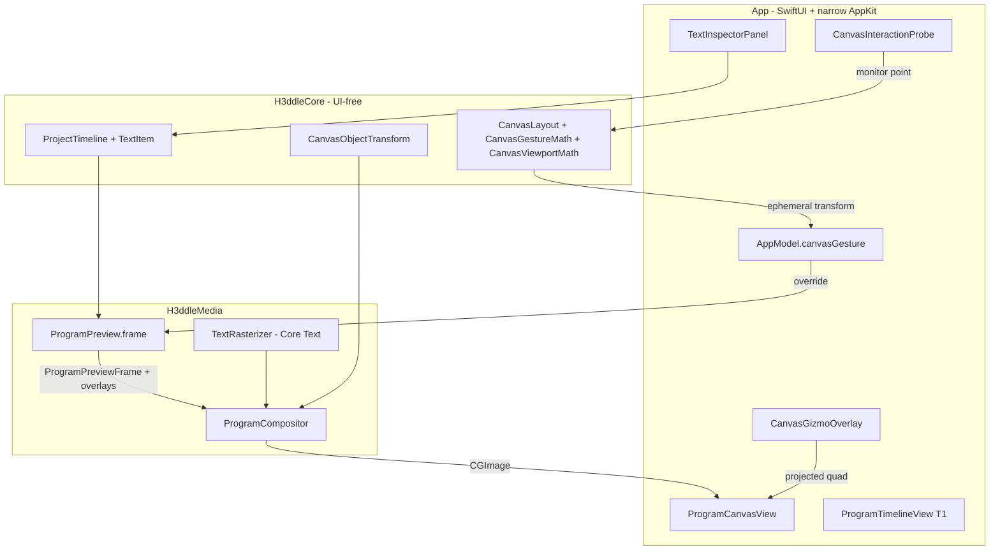
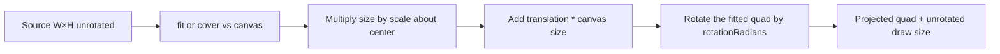
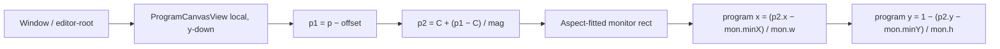
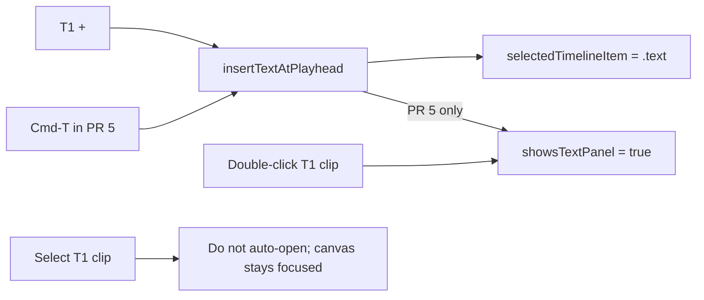
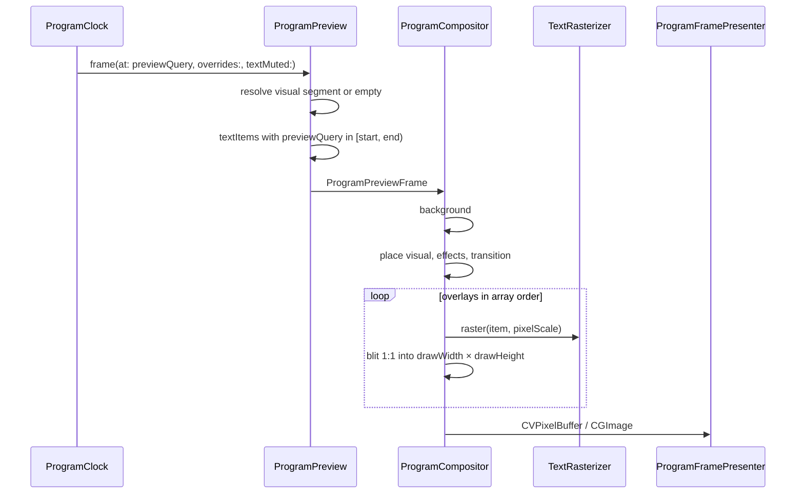

# Canvas Object Interactions and 2D Text Track

| Field | Value |
| --- | --- |
| Status | Draft |
| Author | H3ddle engineering |
| Date | 2026-08-15 |
| Schema impact | `H3ddleProject.currentSchemaVersion` 1 → 2 (stamped unconditionally in PR 1) |
| Companion ADR | `docs/decisions/0006-overlay-text-and-canvas-objects.md` (new) |
| Product contract | Update `docs/product-contract.md` in the same PRs that land behavior |

This document specifies how H3ddle grows from a two-track, fit/cover/90° program into a program that can move, scale, and rotate canvas objects, and that can overlay document-owned 2D text on a dedicated T1 lane. It is written against the code in this repository as of 2026-08-15. Visible interaction targets come from a private reference editor; that editor's types, schemas, assets, and identifiers are out of scope and do not appear here. ADR 0006 must keep the same clean-room surface: H3ddle-native names (`T1`, `CanvasObjectTransform`) and H3ddle measurements only.

---

## Overview

Today H3ddle's program monitor is a non-interactive poster of `ProgramCompositor` output. `VisualCanvasTransform` can only letterbox or cover and rotate in 90° steps. `ProjectTimeline` has ordered visuals and absolutely-timed audio. There is no overlay layer, no object gizmo, and no undo stack. The composed frame in `ProgramCanvasView` sets `allowsHitTesting(false)`; every left-drag pans `CanvasViewport`.

This design extends the existing UI-free math type so a visual clip and a 2D text clip share one transform, applied only inside `ProgramCompositor` (the single preview/export path). A SwiftUI gizmo plus a single AppKit pointer probe sit on the monitor, convert through a closed-form viewport mapping into program-canvas space, and commit one transform per completed gesture onto a snapshot undo stack. A new T1 Text lane stores document-owned styled strings with explicit start times, laid out in `ProjectSettings` pixels and drawn after the visual. Preview and export share that compositor; they use **different query clocks**. Export duration is `max(visualDuration, textTrackEnd)` when the text lane is included — an intentional exception to ADR 0003 for overlay text only. Cinematic 3D text, caption-from-speech, and per-glyph animation stay out of v1.

---

## Background & Motivation

### Current transform and compositor

`Packages/H3ddleKit/Sources/H3ddleCore/CanvasLayout.swift` is the whole placement model:

- `CanvasFit` is `.fit` or `.cover`.
- `VisualCanvasTransform` is `{ fit, rotationTurns ∈ 0...3 }`.
- `CanvasLayout.destination` orients the source by quarter-turns, scales it, and **centers** the result. There is no translation, no continuous scale, no continuous angle.

`VisualItem` stores `canvasFit` and `rotationTurns` as separate fields and exposes a computed `canvasTransform` (`Packages/H3ddleKit/Sources/H3ddleCore/Timeline.swift`). Mutations are `setVisualCanvasFit` (assigns `canvasFit` only) and `rotateVisual` (quarter-turns, wrapping via `CanvasLayout.normalizedTurns`).

`ProgramCompositor.draw` (`Packages/H3ddleKit/Sources/H3ddleMedia/ProgramCompositor.swift`) places one `CGImage` with that transform. Bitmap contexts are y-up; rotation is negated so it matches SwiftUI's clockwise `rotationEffect`. Effects run **after** placement. Transitions rasterize each side onto its own canvas, then mix. There is no overlay pass.

`ProgramPreviewFrame` (`ProgramPreview.swift`) carries one `visual`, one `visualTransform`, an effect stack, an optional `ProgramVisualMix`, and an audio list. `ProgramCompositionPlan.duration` is `timeline.visualDuration`. `ProgramPreview.queryTime` clamps to `plan.duration - ε` (visual only). Export (`ProgramExporter` → `ExportSessionWriter.frame`) calls `ProgramPreview.frame` per output frame with **no mute flags**. Preview and export already share the compositor; they must keep doing so.

### Current monitor

`ProgramCanvasView` draws the composed `NSImage` inside an aspect-fitted `monitorSurface`, then applies `CanvasViewport.magnification` and `offset`. The surface cannot be hit. A full-size `Color.clear` layer owns:

- `DragGesture` → `viewport.pan`
- `MagnifyGesture` → zoom, clamped to `0.25...8`
- double-tap → `viewport.reset()`
- scroll-wheel (no Control) → pan. Control-scroll is **excluded** from this monitor and is **not** zoom; Control-scroll zoom exists only on the timeline (`ProgramTimelineView`)
- `SecondaryClickProbe` → select the **visual under the playhead**, not the object under the pointer, and open the clip menu

`refreshPreview` bails out when `visualItems.isEmpty` (`presenter.clear()`), so a title-only project cannot draw. Space is play/pause (`EditorView.onKeyPress(.space)`). There is no object move, scale, or rotate.

### Current timeline

Lane order in `ProgramTimelineView` / `TrackHeaderColumn` is optional FX → **V1 Visual** → **A1 Audio**. Chrome lives in `TimelineChrome`: `headerWidth` 128, `rulerHeight` 30, `visualLaneHeight` 112, `audioLaneHeight` 56, `effectLaneHeight` 24. There is no header **height** of 128. `TimelineItemID` is `.visual` / `.audio` only. Insert of generated or imported media is append-after-last (`docs/product-contract.md`). Audio stores `startTime`; visuals derive start from order + `gapBefore` + transition overlap. Export ends at visual duration; trailing audio is a warning (`ProgramCompositionPlan.requiresTrailingAudioWarning`).

`AppModel.toggleVisualNativeAudio` rebuilds `ProjectTimeline(visualItems:audioItems:)` and would drop a defaulted `textItems: []`. `AppendMenuPlacement` is `isVisual: Bool` — there is no third track state.

There is no project undo today (`AppModel` mutates `project.timeline` in place). This design ships a snapshot undo/redo stack: one push per completed gesture, insert, or inspector commit.

### Why now

Titles, lower-thirds, and simple captions cannot be expressed without an overlay track. Fit/cover/90° cannot place a lower-third or a punched-in still. Users already treat the monitor as an object surface (right-click "selects something"), then discover that every drag pans the viewport. The compositor is the right place to apply a richer transform: one path, one set of tests, no SwiftUI-only preview lie.

---

## Goals & Non-Goals

### Goals

1. Select a visual or a 2D text object on the program monitor and show a selection outline plus four corner handles aligned to the object's projected rectangle.
2. Move a **selected** object so on-screen displacement tracks the pointer 1:1 in monitor pixels (tolerance 3 px).
3. Scale uniformly from a corner handle about the opposite corner. **⌘-scale** scales about the object's center instead. For text, scale writes `CanvasObjectTransform.scale`; authored `fontSize` and optional box width do not change.
4. Rotate continuously about the object's center; store radians on the shared transform. **⇧-rotate** snaps to 15° increments. Fit/cover remain snap-to-frame **presets**, not the only transform. Media is fit/covered **unrotated**, then the fitted quad is rotated (no size-breathing during a live rotate).
5. Commit each completed pointer gesture once. Live drag is ephemeral. Mouse-up always commits and pushes **one** undo snapshot.
6. Keep empty-canvas pan/zoom and the existing scroll-wheel / pinch / double-tap viewport without stealing object gestures.
7. Select from the timeline clip **and** by clicking the object. Unselected text selects only on a visible glyph; once selected, the full expanded bounds (including gaps and background padding) move the object.
8. Add a T1 Text lane above V1. Insert 2D text at the playhead, select it, and draw it after the visual so preview and export match. Preview of a title-only or playhead-past-picture frame is background + overlays.
9. Ship a 2D static-text inspector whose primary fields are content, family/weight/italic, alignment, and fill. Advanced: wrap/whitespace, line height, letter spacing, stroke, shadow, background padding/radius.
10. Keep domain models in `H3ddleCore` free of SwiftUI, AppKit, AVFoundation, and Core Text. Use Swift 6 complete concurrency checking.
11. Snapshot undo/redo (⌘Z / ⇧⌘Z) wrapping every commit point. Live drag does not push until mouse-up.

### Non-goals (explicitly staged)

- 3D / extruded text, cinematic glyph engines, caption-from-speech, per-glyph or typewriter animation, motion-blurred text. v1 is static titles, lower-thirds, and captions.
- Side/edge handles that edit box width. v1 text is content-sized; wrap width is an advanced numeric field only.
- In-place canvas text editing (caret in transformed space). v1 edits content in the inspector.
- Multiple text lanes (T2, T3), nested folders, or linked-to-visual captions. Z-order on T1 is enough this generation.
- A typed command-protocol undo system. Snapshots of `H3ddleProject` are enough.
- Letting **audio** extend the export file. Trailing audio still warns and is truncated at the export end. Overlay text is the only exception to ADR 0003's visual-authoritative file length.
- Web, WASM, or third-party text engines.
- Bundled webfonts or shipping font files in the app bundle.
- Freely transforming **effects** or **transitions** (they remain clip-attached, post-placement).
- Persistence format work beyond schema v2 field defaults (projects are still in-memory `H3ddleProject` values).
- Control-scroll zoom on the program monitor (not implemented today; do not pretend it exists).
- Cancelling an in-flight gizmo drag by clicking Duplicate/Enable (mouse-up commits first).

---

## Proposed Design

### Architecture



The gizmo never bakes pixels. The only draw path that can change what export looks like is `ProgramCompositor`.

### 1. Transform model

#### Shared type

Replace the two-field `VisualCanvasTransform` with a single math value used by visuals **and** text. Keep the old name as a typealias for one PR so `ProgramPreview` / compositor call sites can move incrementally.

```swift
/// UI-free placement + free transform. Translation is normalized to the
/// program canvas: +x is right, +y is up, 1.0 is one canvas width/height.
/// Rotation is clockwise radians, matching SwiftUI and the existing
/// compositor sign flip (bitmap contexts are y-up).
public struct CanvasObjectTransform: Hashable, Codable, Sendable {
  public var fit: CanvasFit
  public var translationX: Double
  public var translationY: Double
  public var scale: Double
  public var rotationRadians: Double

  public static let identity = CanvasObjectTransform()

  public init(
    fit: CanvasFit = .fit,
    translationX: Double = 0,
    translationY: Double = 0,
    scale: Double = 1,
    rotationRadians: Double = 0
  ) {
    self.fit = fit
    self.translationX = translationX
    self.translationY = translationY
    self.scale = max(scale, 0.01)
    self.rotationRadians = rotationRadians
  }

  /// Legacy / test convenience. Sets `rotationRadians = turns * π/2`.
  public init(fit: CanvasFit = .fit, rotationTurns: Int) {
    self.init(
      fit: fit,
      rotationRadians: Double(CanvasLayout.normalizedTurns(rotationTurns)) * .pi / 2
    )
  }

  /// Nearest quarter-turn, **hint only**. Ignore on decode when `rotationRadians` exists.
  public var rotationTurns: Int {
    CanvasLayout.normalizedTurns(
      Int((rotationRadians / (.pi / 2)).rounded())
    )
  }

  public func rotated(by turns: Int = 1) -> CanvasObjectTransform {
    var next = self
    next.rotationRadians += Double(turns) * .pi / 2
    return next
  }
}

public typealias VisualCanvasTransform = CanvasObjectTransform
```

`init(fit:rotationTurns:)` keeps `CanvasLayoutTests` and `ProgramCompositorTests` (`VisualCanvasTransform(fit: .fit, rotationTurns: 1)`) compiling.

`fit` is meaningful for media. Text ignores it (content-sized source; see below). Keeping the field on the shared type avoids a second transform struct.

#### Composition (fit unrotated, then rotate)

`CanvasLayout.destination` grows so fit/cover and the free transform compose in a fixed order. **Media is fitted against the unrotated source, then the fitted quad is rotated.** That keeps 0° and 90° numerically identical to `CanvasLayoutTests.fitAndCover` / `rotationSwapsFittedBox`, and a live gizmo rotate does **not** pulse the object's size. At 45° the axis-aligned bounding box may exceed the frame; corners clip.

`destination` is **media-only**: `sourceWidth/Height` and `canvasWidth/Height` are in the same pixel space (the compose buffer). It has no `layoutWidth` and no `appliesFit`. Text placement does **not** go through this function; `ProgramCompositor` maps settings-pixel `expandedSize` into compose pixels (pipeline below).



The existing `Rect`-returning `destination(sourceWidth:sourceHeight:canvasWidth:canvasHeight:transform:)` **stays**. It is a wrapper that returns `Placement.aabb` so `fitAndCover` and `rotationSwapsFittedBox` remain pixel-identical and PR 2 can keep using `Rect` until it switches to `Placement`.

```swift
public extension CanvasLayout {
  /// Media placement. `source` and `canvas` are the same pixel space
  /// (the compose buffer). Fit/cover run on the unrotated source.
  static func destination(
    sourceWidth: Double,
    sourceHeight: Double,
    canvasWidth: Double,
    canvasHeight: Double,
    transform: CanvasObjectTransform
  ) -> Placement

  /// Existing signature. Returns `destination(...).aabb`.
  static func destinationRect(
    sourceWidth: Double,
    sourceHeight: Double,
    canvasWidth: Double,
    canvasHeight: Double,
    transform: CanvasObjectTransform
  ) -> Rect

  struct Placement: Equatable, Sendable {
    public var centerX: Double
    public var centerY: Double
    public var drawWidth: Double   // unrotated draw size in compose pixels
    public var drawHeight: Double
    public var rotationRadians: Double
    public var aabb: Rect          // axis-aligned bounds after rotation
  }
}
```

Keep the current `destination(...) -> Rect` name as a wrapper around `Placement.aabb` so `CanvasLayoutTests` do not rename. The `Placement`-returning overload can be `placed(...)` if two `destination`s collide; PR 1 picks one name and keeps the `Rect` tests on the wrapper.

For media:

1. Ignore `θ` when computing fit. Oriented size at this step is `(sourceWidth, sourceHeight)`.
2. `fitScale = min(canvasW / sourceW, canvasH / sourceH)` or `max` for cover. Degenerate sizes keep today's empty-rect fallback.
3. `drawScale = fitScale * transform.scale`.
4. `drawWidth/Height = source * drawScale` (unrotated).
5. `center = (canvasW/2 + translationX * canvasW, canvasH/2 + translationY * canvasH)`.
6. `θ = transform.rotationRadians` is applied at draw time (translate to center → rotate `−θ` → draw unrotated image). `aabb` is the AABB of that rotated draw rect and **may exceed the canvas** at non-quarter angles.

For a 200×100 source on a 200×200 canvas at `θ = π/2`, `scale = 1`, `translation = 0`:

- Unrotated fit: `fitScale = min(200/200, 200/100) = 1`, draw = 200×100, center = (100, 100).
- After 90° rotate the visual occupies 100×200, matching today's `rotationSwapsFittedBox`.

A continuous rotate of a fitted still therefore **keeps draw width/height constant**. Only `aabb` grows and shrinks. Do not promise that `aabb` stays inside the frame.

#### Text pipeline (one recipe — do not invent a second multiply)

Text is authored in **`ProjectSettings` pixels**. Preview does **not** compose at settings size (`ProgramFramePresenter.raster` is monitor × backing scale, capped at 1920 on the long edge). Export often does **not** either: `ProgramExportSettings.outputPixelSize` re-applies the export resolution preset (1080p project → 4K file is 3840×2160). Images survive because media `destination` remaps source pixels into the compose buffer. Text must not treat a 48 pt Core Text box as compose pixels, and it must not scale the same factor at raster time **and** blit time.

**The only pipeline:**

```
1. Layout in settings pixels
   fontSize, boxWidth, tracking, stroke, shadow, wrap
   → expandedSize  (ink ∪ pad ∪ stroke ∪ shadow), settings pixels
   → TextLayout    (glyphBounds / lineFragments in that space)

2. pixelScale = composeScale * transform.scale
   composeScale = composeWidth / layoutWidth
   (composeHeight / layoutHeight must equal that ratio; aspect-fitted)
   Degenerate layoutWidth < 1 → composeScale = 1
   While AppModel.canvasGesture != nil: quantize pixelScale to 5% steps
   On commit and export: exact pixelScale

3. Raster
   TextRasterizer.raster(item, layoutSize:pixelScale:)
   → CGImage of size ceil(expandedSize * pixelScale)
   → same TextLayout (still settings pixels)

4. Place in ProgramCompositor (not CanvasLayout.destination)
   drawWidth  = expandedSize.width  * composeScale * transform.scale
   drawHeight = expandedSize.height * composeScale * transform.scale
   center     = (composeW/2 + translationX * composeW,
                 composeH/2 + translationY * composeH)
   Blit the raster INTO that unrotated rect (1:1, no second multiply)
   then rotate by −θ about center, same as media.

5. Hit-testing maps expandedSize (and glyphBounds) with the same
   composeScale * transform.scale into compose / program space.
```

There is no `appliesFit` on text. There is no “raster at settings size then blit with `drawScale`.” The bitmap’s pixel size **is** the draw rect. A gizmo scale of 2 makes a 2× larger raster and a 2× larger draw rect, not 4×.

```swift
public final class ProgramCompositor {
  public let width: Int          // compose buffer
  public let height: Int
  public let layoutWidth: Int    // ProjectSettings.width
  public let layoutHeight: Int   // ProjectSettings.height

  public var composeScale: Double {
    Double(width) / Double(max(layoutWidth, 1))
  }

  /// Existing tests stay green: layout defaults to the buffer so composeScale == 1.
  public init(
    width: Int,
    height: Int,
    background: (CGFloat, CGFloat, CGFloat) = (0, 0, 0),
    backgroundAlpha: CGFloat = 1,
    layoutWidth: Int? = nil,
    layoutHeight: Int? = nil
  )

  /// Preview / export of a project: buffer may differ from settings.
  public init(
    width: Int,
    height: Int,
    layoutWidth: Int,
    layoutHeight: Int,
    background: ProjectBackground,
    fillsBackground: Bool = true
  )
}
```

**Every compositor that draws a project** takes explicit `layoutWidth/Height` from `project.settings`:

| Caller | Buffer (`width`/`height`) | Layout |
| --- | --- | --- |
| Existing unit tests / `init(width:height:background:)` | as given | defaults to the buffer |
| `init(settings:)` | `settings.width × height` | same (preview-at-project-size, unused for export) |
| `ProgramFramePresenter` | `raster(monitor, backingScale)` | `project.settings` |
| `ExportSessionWriter` (hardware **and** software) | `settings.outputPixelSize(project:)` | `project.settings` |

Do **not** use `init(settings:)` for export. That would make the buffer 1080p while the file is 4K, or set layout = 4K and blow up authored 48 pt titles.

Changing `ProjectSettings` width/height after insert: **translation is normalized** (a 0.1 shift stays 10% of the new canvas). **`fontSize`, `boxWidth`, stroke, and shadow stay absolute settings-pixel values captured at insert.** A 48 pt title on a project that later becomes 4K occupies a smaller frame fraction. That is intentional; v1 does not rescale style on settings change. The insert default `fontSize = 48 * (settings.height / 1080)` only runs at insert time.

#### Fit / cover remain presets

`setVisualCanvasFit` does **not** stay a one-field assign. Applying Fit or Cover:

- writes `fit`
- sets `translationX = translationY = 0`
- sets `scale = 1`
- **keeps** `rotationRadians`

That is the "snap into the frame" behavior. Because fit is computed on the unrotated source, snap-to-frame after a 45° rotate still letterboxes the **unrotated** still and then rotates it; the AABB may stick out. Users who want the diamond fully inside the frame re-apply Fit and then accept the overflow, or scale down. The clip-menu items "Fit to canvas" / "Cover canvas" stay. "Rotate" on the visual clip menu becomes `transform.rotated(by: 1)` (add `π/2`), not a reset of the free angle.

Do **not** bake fit/cover into a one-shot free transform and then drop the mode. Users re-apply Fit after dragging; the preset must remain a verb.

#### Reset transform

| Target | `resetTransform` result |
| --- | --- |
| Visual | `CanvasObjectTransform(fit: item.canvasFit, translationX: 0, translationY: 0, scale: 1, rotationRadians: item.rotationRadians)` — keep preset + angle, zero translation/scale |
| Text | `CanvasObjectTransform.identity` — centered, scale 1, rotation 0. `fit` is unused |

Reset is a clip-menu item for both. It is immediate (not a live gesture).

#### `VisualItem` storage and schema v1 decode

Do not nest a new object in v1 JSON. Follow the existing `decodeIfPresent` pattern already used for `sourceOffset`, `gapBefore`, `canvasFit`, `rotationTurns`, `transition`, and `effects`. `VisualItem.CodingKeys` **must** include the four new fields or the custom `init(from:)` will not persist them.

New stored fields on `VisualItem`:

| Field | Default | Notes |
| --- | --- | --- |
| `translationX` | `0` | normalized |
| `translationY` | `0` | normalized, +up |
| `uniformScale` | `1` | named to avoid colliding with "scale" in other layers |
| `rotationRadians` | derived | if absent, `Double(rotationTurns) * .pi / 2` |

`canvasFit` and `rotationTurns` stay on the item so schema v1 files keep decoding. After decode, `rotationTurns` is a **nearest-quarter hint**; `rotationRadians` is the source of truth. A 45° item (`π/4`) encodes `rotationTurns == 1`. Readers of the JSON field must ignore `rotationTurns` when `rotationRadians` is present. `rotateVisual` adds `π/2` to `rotationRadians` and writes `rotationTurns = transform.rotationTurns` so 90° increments stay honest.

```swift
public var canvasTransform: CanvasObjectTransform {
  get {
    CanvasObjectTransform(
      fit: canvasFit,
      translationX: translationX,
      translationY: translationY,
      scale: uniformScale,
      rotationRadians: rotationRadians
    )
  }
  set {
    canvasFit = newValue.fit
    translationX = newValue.translationX
    translationY = newValue.translationY
    uniformScale = newValue.scale
    rotationRadians = newValue.rotationRadians
    rotationTurns = newValue.rotationTurns  // nearest quarter, hint only
  }
}
```

New timeline mutations:

```swift
public mutating func setVisualCanvasTransform(_ id: UUID, _ transform: CanvasObjectTransform)
public mutating func setVisualIncludesNativeAudio(_ id: UUID, _ includes: Bool)
```

`setVisualCanvasFit` and `rotateVisual` become wrappers that assign `canvasTransform`. `AppModel.toggleVisualNativeAudio` must call `setVisualIncludesNativeAudio` and **must not** reconstruct `ProjectTimeline(visualItems:audioItems:)`. Every remaining `ProjectTimeline(...)` call site must pass `textItems:` explicitly. The memberwise init grows `textItems: [TextItem] = []` as a default so existing tests compile; that default is a footgun — reconstructs that omit it wipe titles. Add a test that a reconstruct without `textItems:` is not used on the native-audio path, and that `setVisualIncludesNativeAudio` keeps `textItems`.

`duplicateVisual` / `splitVisual` already copy `canvasFit` and `rotationTurns`; they must also copy the four new fields (same way they copy effects via `copying()`).

`H3ddleProject.currentSchemaVersion` becomes `2` **unconditionally** in PR 1. There is no per-document writer policy in code today (`Project.swift` is a single static). Schema 1 documents decode because every new field is optional with a default. `ProjectTimeline` gains a custom `init(from:)` so a missing `textItems` key becomes `[]` (synthesized `Codable` would fail). `schemaVersion` is stored as today and **not** validated to `{1,2}` (matches `H3ddleProject.init(from:)`). ADR 0006 records that readers accept 1 and 2 and decode unknown future versions best-effort.

### 2. Gizmo versus compositor

#### Rule

The SwiftUI overlay is a **view** of `CanvasLayout.Placement`. It must not apply `scaleEffect` / `offset` / `rotationEffect` to the composed image as a substitute for the compositor. Live drag updates an ephemeral `CanvasObjectTransform` that `ProgramPreview.frame` reads as an override; `ProgramCompositor` then draws the same pixels preview and export will use.

#### Coordinate spaces (closed form)



**Origins.**

- Program `(0, 0)` = monitor **bottom-left**, y-up, range `0...1`.
- Program `(1, 1)` = monitor **top-right**.
- Translation `(0, 0)` = object center on canvas center = program `(0.5, 0.5)`. Translation and program space share units (fractions of canvas width/height) but not origin.

**Layout of `monitorSurface` (from `ProgramCanvasView`).** The tree is `monitorSurface` (`.aspectRatio(settings.aspectFraction, contentMode: .fit)`) → `.padding(32)` → `.scaleEffect(viewport.magnification)` (default **view-center** anchor) → `.offset(viewport.offset)` → `.frame(viewSize)`. `scaleEffect` / `offset` do not change layout size. The padded aspect-fit block is therefore centered in the view, and for a 16:9 monitor in a 400×300 view with 32 pt padding the padded block's center **is** the view center.

Closed form, all in view points, y-down:

```
C = (viewW / 2, viewH / 2)
p1 = viewPoint − offset
p2 = C + (p1 − C) / magnification

available = (viewW − 2·padding, viewH − 2·padding)
monitorSize = aspect-fit(settings.aspect, into: available)
paddedSize = monitorSize + (2·padding, 2·padding)
paddedOrigin = C − paddedSize / 2
monitorOrigin = paddedOrigin + (padding, padding)
monitor = CGRect(origin: monitorOrigin, size: monitorSize)

if p2 is outside the aspect-fitted rounded monitor rect (including the 32 pt pad
and any letterbox outside the fit): return nil
program.x = (p2.x − monitor.minX) / monitor.width
program.y = 1 − (p2.y − monitor.minY) / monitor.height
```

`viewPoint(program:)` is the exact inverse. `nil` means **empty canvas**: click deselects, drag pans. The pad and the letterbox outside the rounded monitor are empty canvas.

**Numeric fixture** (must appear in `CanvasGestureMathTests`):

| Input | Value |
| --- | --- |
| `viewSize` | 400 × 300 |
| `padding` | 32 |
| aspect | 16:9 |
| `magnification` | 2 |
| `offset` | (10, −4) |

Derived monitor (unscaled): available 336 × 236 → 16:9 fit 336 × 189. Padded layout 400 × 253, centered in 400 × 300 → padded origin (0, 23.5). Monitor rect `(x: 32, y: 55.5, w: 336, h: 189)`. View center `C = (200, 150)`.

| Program | Unscaled view | After mag 2 about C + offset (10, −4) |
| --- | --- | --- |
| (0.5, 0.5) | (200, 150) | (210, 146) |
| (0, 0) bottom-left | (32, 244.5) | (−126, 335) |
| (0, 1) top-left | (32, 55.5) | (−126, −43) |
| (1, 1) top-right | (368, 55.5) | (546, −43) |

`programPoint` of those view points must invert to the program column within 1e-6. A 10 pt drag on a 200 × 100 monitor at **mag 1, offset 0** still changes translation by `(0.05, ±0.10)`. Add a mag-2 case: 10 pt of **view** drag is 5 pt of monitor drag, so translation changes by half that.

`App/Sources/Features/Editor/Canvas/CanvasViewport.swift` stays a tiny UI value (`magnification`, `offset`, clamp helpers). It does not learn about objects.

Hit-testing uses the **projected quad** (four corners of the unrotated draw rect, rotated around center), not the AABB, so a rotated still does not steal clicks in empty AABB corners. A point is inside if it is inside the convex quad (same-side test). Tolerance: 3 px in **monitor** space, converted to normalized using `3 / monitorWidth` and `3 / monitorHeight`.

#### What the overlay draws

Shown only when `selectedTimelineItem` is a visual or text clip that is active at the playhead, **enabled**, and on a **non-muted** lane:

- 1 pt selection outline along the projected rectangle (four edges).
- Four square corner handles, **constant screen size** (~8 pt), drawn in view space so zoom does not inflate them.
- One rotation stem from the top edge of the local box (in object space) to a circular handle, also constant screen size.
- A compact floating quick-action strip (Duplicate, Enable/Disable) above the AABB, clamped inside the monitor, **still visible during the drag**.

The overlay sits in the same `ZStack` as today's hit layer, **not** inside the scaled `monitorSurface`. Handle size is stable and hit-testing shares one coordinate transform.

A muted T1 or V1 lane shows no gizmo and is not hittable. Disabled clips are not hittable and show no gizmo.

#### Gesture session

```swift
struct CanvasGestureSession: Equatable {
  enum Kind: Equatable {
    case move
    case scale(CanvasCorner)  // opposite-corner pivot unless command is down
    case rotate
  }
  var target: TimelineItemID
  var kind: Kind
  var origin: CanvasObjectTransform
  var current: CanvasObjectTransform
  var shiftDown: Bool      // sampled continuously during the drag
  var commandDown: Bool
}
```

`AppModel.canvasGesture` is optional. `ProgramCanvasView` **must** observe it:

```swift
.onChange(of: model.canvasGesture) { _, _ in refreshPreview() }
```

`refreshPreview` passes `canvasGesture` into `ProgramPreview.frame(..., transformOverrides:)`. `@Observable` does not help unless `refreshPreview` (or `body`) **reads** `canvasGesture`.

Pointer-up calls `registerUndoCheckpoint()` then `setVisualCanvasTransform` / `setTextTransform` **once** and clears the session. **Mouse-up always commits and pushes one undo snapshot.** During the drag, **do not** write `project.timeline` and **do not** push undo (mouse-down is not a checkpoint).

Quick-action buttons remain visible during a drag but **cannot cancel it**. A drag owns the mouse; the first mouse-up goes to the probe and commits. A later click on Duplicate copies the **committed** transform. Do not specify “tap Duplicate to revert to `origin`” — that input sequence does not exist.

### 3. Gesture arbitration

Today `highPriorityGesture(panGesture)` wins every left-drag. That must be replaced, not patched with a modifier that fights Space (Space is play/pause).

#### Pointer policy

| Input | Target | Result |
| --- | --- | --- |
| Left-click, movement < 2 pt | Unselected visual quad | Select visual |
| Left-click, movement < 2 pt | Unselected text **glyph** | Select text |
| Left-click, movement < 2 pt | Unselected text gap (not ink, not selected bounds) | Miss (fall through) |
| Left-click, movement < 2 pt | Empty monitor (including pad / letterbox) | Deselect |
| Left-drag | Interior of **selected** object | Move, 1:1 monitor pixels |
| Left-drag | Unselected visual | Select + move in the same gesture |
| Left-drag | Unselected text glyph | Select only; do **not** move until a later drag on the selected bounds |
| Left-drag | Corner handle of selected object | Uniform scale about opposite corner |
| ⌘ + left-drag | Corner handle of selected object | Uniform scale about the **object center**; translation unchanged |
| Left-drag | Rotation handle | Continuous rotate about center |
| ⇧ + left-drag | Rotation handle | Rotate about center, **snapped to 15°** (`π/12`) |
| Left-click / drag | Empty monitor, movement ≥ 2 pt | Pan viewport; **keep** selection |
| ⌥ + left-drag | Anywhere on the monitor | Force viewport pan (escape hatch). Wins over handle gestures |
| Pinch | Monitor | Existing `MagnifyGesture` zoom |
| Scroll-wheel (no Control) | Monitor | Existing pan |
| Control-scroll | Monitor | **Not handled** (pass through). Timeline zoom only |
| Double-tap | Monitor | `viewport.reset()` |
| Space | Editor | Play / pause. **Not** a pan modifier |
| ⌘Z / ⇧⌘Z | Editor (inspector field not first responder) | Undo / redo |
| Right-click / Control-click | Object under pointer, else playhead visual | Clip menu |

**Modifier precedence (no collisions):**

1. **Option** anywhere on the monitor → force pan. Decided at mouse-down; Option+handle does not scale/rotate.
2. **Command** applies only to an in-progress **scale**. Pivot = object center. Ignored on move and rotate.
3. **Shift** applies only to an in-progress **rotate**. Snap `θ` to the nearest `n · π/12`. Ignored on move and scale.
4. Control remains right-click / timeline zoom. Space remains play/pause.

Modifiers are sampled **continuously** during the drag (press or release Shift/Command without restarting). Option is not live-toggled mid-object-gesture: if the drag started as scale/rotate, it stays that kind until mouse-up.

**Hit-test order** (left-click and right-click):

1. Walk `overlays` in **reverse array order** (later `textItems` index is on top).
2. Then the current visual: the **incoming** segment during a mix, matching `ProgramPreview.segment(at:)` (last placement containing the query). Both mix quads are drawn; only the incoming clip is selectable from the monitor, consistent with the playhead owning the incoming transition.
3. Skip any item that is disabled, or whose lane is muted.
4. Unselected text: glyph ink only (transformed `glyphBounds`). Selected text: the **projected quad** of the expanded unrotated rect (ink ∪ pad ∪ stroke ∪ shadow), same same-side test as visuals — **not** `Placement.aabb`. After a 45° rotate the AABB would steal empty corners.
5. Half-open membership `[start, end)` — `query >= start && query < end` — identical to audio in `ProgramPreview.frame`.

If the pointer misses, right-click falls back to today's "visual under the playhead" so an empty-canvas right-click still opens the current clip menu when a visual occupies the playhead.

Text's two-phase hit rule is deliberate: first contact must be ink; once selected, transparent gaps and background padding are part of the move target.

#### Implementation split — one probe

Do **not** stack `SecondaryClickProbe` and a second full-size `CanvasInteractionProbe`. `SecondaryClickProbe.hitTest` already returns `nil` for plain left-drags; a second representable in the same overlay either steals right-click or never sees left-click.

**Merge left + right into one `CanvasInteractionProbe`** that replaces `SecondaryClickProbe` on the monitor (the timeline probe is unchanged):

- `hitTest` copies the selective pattern: return `self` for left-drag, Option-drag, right-click / Control-click; return `nil` over SwiftUI gizmo chrome (quick-action buttons, and any inspector-unrelated controls in that overlay) so those views receive the event; return `nil` for everything else (pinch, scroll-wheel — those stay on SwiftUI).
- Owns `mouseDown` / `mouseDragged` / `mouseUp` for the left button and `rightMouseDown` for the menu.
- Converts the window point into view space, then `CanvasViewportMath.programPoint`. Asks `CanvasInteractionController` (a small `@MainActor` type owned by `ProgramCanvasView`) which hit was under the pointer and which `Kind` to start. Does **not** import `H3ddleMedia`.

SwiftUI keeps pinch, scroll-wheel pan, double-tap reset, and **draws** the gizmo + quick actions. Viewport pan from empty-canvas / Option-drag is performed by the probe calling `viewport.pan(by:)`, not by the old full-view `DragGesture`.

This is the recommended hybrid (see Alternatives). A pure-SwiftUI `highPriorityGesture` stack is how the current monitor ended up eating every drag.

#### Scale and rotate math

Also UI-free, in `CanvasGestureMath`:

**Move.** Work in program-normalized space after `CanvasViewportMath`. `Δnormalized = Δprogram`. Add to `translationX/Y`. 1:1 in monitor pixels at mag 1 by construction. At mag ≠ 1 the inverse mapping already divides out magnification, so a 10 pt **view** drag at mag 2 is 5 monitor pixels.

**Scale about opposite corner** (default, Command up). Work in program pixels (`program * canvasSize`).

1. Snapshot the four corners of the unrotated draw rect, rotate them by `θ` around center → program-space quad.
2. Pivot = opposite corner. Grab = the handle corner.
3. On move, project the pointer onto the vector `grab − pivot` (uniform scale; no shear).
4. `s' = s * (‖pointer − pivot‖ / ‖grab − pivot‖)`, clamped to `≥ 0.05`.
5. Recompute center so the pivot corner stays fixed after the new scale (`fitScale` is constant during the gesture — it does not depend on `θ`; only `scale` and translation change).
6. Convert the new center back to normalized translation.

**Scale about center** (Command down). Same ratio `s'`, but **do not** recompute the center. `translationX/Y` stay at `origin`. The opposite corner moves.

`CanvasGestureMath.scaled(..., aboutCenter: Bool)` implements both. Switching Command mid-drag recomputes from `origin` + the current pointer (no jump from a stale pivot).

**Rotate.** `θRaw = origin.θ + atan2` difference between start vector and current vector, both from center, in program space with y-up. Clockwise in view space (y-down) is clockwise in the stored angle because of the y flip. Draw width/height do not change (fit-then-rotate).

**⇧-rotate snap:** `θ' = round(θRaw / (π/12)) * (π/12)`. 0°, 15°, 30°, … 345°. Snap is applied every move while Shift is down; releasing Shift returns to the unsnapped `θRaw` from the same origin.

Live rotate/scale must not fight `CanvasFit`. The preset stays whatever it was; only `scale` and translation (and `rotationRadians` for rotate) change. Applying Fit later still zeros those extras.

### 4. Text as a third track

#### Timing model

Text is an **overlay lane with explicit start times**, like audio, not an ordered media lane like V1.

| | V1 Visual | T1 Text | A1 Audio |
| --- | --- | --- | --- |
| Clock | Shared | Shared | Shared |
| Start | Derived from order | Explicit `startTime` | Explicit `startTime` |
| Source | `AssetReference` | Document-owned | `AssetReference` |
| Overlap | No (order + transitions) | **Yes** | No (neighbor clamp) |
| Disable | Keeps duration, renders empty | Hidden, keeps timing | Silence, keeps timing |
| Export end | Picture backbone | **Extends the file** when the lane is included | Truncated if past the export end |

Rationale: titles and captions sit on the picture at absolute times. They must be able to start in a gap, overlap a cut, and overlap each other (title + lower-third). Forcing them onto the visual order would steal V1's derived clock and break transitions.

#### `TextItem`

New value type in `H3ddleCore` (`TextItem.swift`):

```swift
public struct TextItem: Identifiable, Hashable, Codable, Sendable {
  public let id: UUID
  public var startTime: TimeInterval
  public var duration: TimeInterval
  public var isEnabled: Bool
  public var text: String
  public var style: TextStyle
  public var canvasTransform: CanvasObjectTransform

  public var endTime: TimeInterval { startTime + duration }
}

public struct TextStyle: Hashable, Codable, Sendable {
  public var fontFamily: String          // requested **family** name from the picker
  public var fontPostScriptName: String? // resolved member; nil → resolve at raster time
  public var fontWeight: Int             // 100...900, default 400
  public var italic: Bool
  public var fontSize: Double            // ProjectSettings points at scale == 1
  public var alignment: TextAlignment    // visual left/center/right; see below
  public var fill: TextColor
  public var wrap: TextWrapMode          // .none (default) or .wrap
  public var boxWidth: Double?           // settings pixels; nil = hug
  public var lineHeight: Double          // multiplier, default 1.2
  public var letterSpacing: Double       // settings pixels, default 0
  public var strokeWidth: Double         // 0 = off
  public var strokeColor: TextColor
  public var shadowOffsetX: Double
  public var shadowOffsetY: Double
  public var shadowBlur: Double
  public var shadowColor: TextColor
  public var backgroundColor: TextColor  // alpha 0 = off
  public var backgroundPadding: Double
  public var backgroundCornerRadius: Double
}

public struct TextColor: Hashable, Codable, Sendable {
  public var r, g, b, a: Double          // 0...1
  public static let clear = TextColor(r: 0, g: 0, b: 0, a: 0)
  public static let white = TextColor(r: 1, g: 1, b: 1, a: 1)
}

public enum TextAlignment: String, Codable, Sendable {
  case leading, center, trailing
}

public enum TextWrapMode: String, Codable, Sendable {
  case none
  case wrap
}
```

Every `TextStyle` field uses `decodeIfPresent` with the default in the table below so adding a field later is not a schema bump.

| Field | Default if missing |
| --- | --- |
| `fontFamily` | `".AppleSystemUIFont"` |
| `fontPostScriptName` | `nil` |
| `fontWeight` | `400` |
| `italic` | `false` |
| `fontSize` | `48` |
| `alignment` | `.center` |
| `fill` | opaque white |
| `wrap` | `.none` |
| `boxWidth` | `nil` |
| `lineHeight` | `1.2` |
| `letterSpacing` | `0` |
| `strokeWidth` | `0` |
| `strokeColor` | opaque black |
| `shadowOffsetX/Y` | `0` |
| `shadowBlur` | `0` |
| `shadowColor` | black 50% |
| `backgroundColor` | clear |
| `backgroundPadding` | `0` |
| `backgroundCornerRadius` | `0` |

**Alignment** is visual left / center / right. The stored names are `leading` / `center` / `trailing` and **mean left / center / right in LTR**. RTL remapping is a later follow-up, not v1.

**Wrap + nil `boxWidth`:** turning wrap on in the inspector (PR 5) writes `wrap = .wrap` and, if `boxWidth == nil`, sets `boxWidth = 0.8 * settings.width`. The rasterizer, if it still sees `.wrap` and `nil`, uses the same 0.8 × layout width so layout is never undefined.

Not an `AssetReference`. Not a `MediaKind`. `MediaKind` stays `video / image / audio`. Import drop on T1 is rejected (`MediaImportLane` does not grow a text case in v1; T1 is not a file drop target).

Defaults for "Add text":

- `text = "Text"`
- Family: system UI font; `fontPostScriptName` resolved at insert if possible; weight 400; italic false
- `fontSize = 48 * (Double(project.settings.height) / 1080)` so a 1080p title and a 4K title start at the same visual size **at insert**
- Alignment: center; fill: opaque white
- Wrap: none; hug content (`boxWidth == nil`)
- Duration: **5 seconds**
- `startTime`: playhead, clamped to `≥ 0`
- Transform: identity (centered, scale 1, rotation 0)
- `isEnabled: true`

`TextRasterizer` rejects strings longer than **8192 UTF-16 units** (truncate to that cap and log). Layout width is capped at 8× `layoutWidth`.

#### Lane chrome

- Header code **`T1`**, title **`Text`**. This matches `V1` / `A1` and is the H3ddle-native name.
- Height: `TimelineChrome.textLaneHeight = 56` (same as A1).
- Color: new `H3Color.clipText` (mauve `#C77DD6`, distinct from `clipVideo` blue and `clipAudio` green).
- Order, top to bottom: optional FX → **T1 Text** → V1 Visual → A1 Audio.
- `TimelineChrome.bodyHeight` adds the text lane always (the lane exists empty, like A1).
- Collapsed scrubber gains a third 15 pt strip. Stack height is **53** (15 + 4 + 15 + 4 + 15). Order matches expanded FX → T1 → V1 → A1: **text y=0, visual y=19, audio y=38**. The collapsed `GeometryReader` frame is 53, not 34.
- Track power button: `textTrackMuted` on `AppModel`, same enable/disable chrome as V1/A1.
- Mute hides overlays in **preview and export**, mirroring audio:
  - `ProgramExportSettings.includeTextLane: Bool` (default `true`).
  - `ExportModalView.seedFromProject` **and** `requestExport` both set `includeTextLane = !model.textTrackMuted`, the same two sites that already assign `includeAudioLane` (`ExportModalView` ~569 and ~578).
  - `ExportSessionWriter.frame` calls `ProgramPreview.frame(..., textMuted: !settings.includeTextLane)`.
  - Gizmo and hit-testing are off when the lane is muted.
- Append control on T1 (`accessibilityIdentifier: "append-text"`). The menu has a single action, "Add text", not Generate / Import.

`AppendMenuPlacement` is no longer `isVisual: Bool`:

```swift
struct AppendMenuPlacement: Equatable {
  enum Track: Equatable { case visual, audio, text }
  var track: Track
  var origin: CGPoint
}
```

`ProgramTimelineView.appendControl` / `toggleAppendMenu` switch on `Track`. T1 `+` cannot reuse a boolean.

#### Overlap and z-order

v1 **allows overlapping text on T1**. `textItems` is an ordered array. **Later index draws on top and is hit first.** Timeline clips that overlap in time occupy the same lane and simply overdraw (selected clip `zIndex` already pops to 4 in `TimelineClipView`).

- Insert appends at the end of `textItems` → new title is on top.
- Duplicate inserts the copy immediately after the source (so the copy is above the original) at `source.endTime`, **without** pushing later items.
- No neighbor clamp on slide (`setTextStart` is just `max(0, startTime)`).
- **T1 body drag is slide-only.** It calls `setTextStart` on mouse-up. It must **not** call a `moveText` pack, must **not** reuse `endAudioMove`, and must **not** change array order. Audio drag reorders and packs when the proposed index changes; copying that helper onto T1 would silently change z-order and pack overlapping titles. Array order changes only via a future Bring to Front / Send to Back (not v1).

A second text lane (T2) is **out of this generation**. Overlap + array z-order on T1 is the v1 model. Bring to Front / Send to Back can wait.

#### Timeline operations

Do **not** copy `AudioTrimMath` or `endAudioMove`. Audio neighbor-clamps and packs; T1 overlaps.

| Op | Behavior |
| --- | --- |
| Insert at playhead | New `TextItem` at `clock.currentTime`, appended (on top), selected. No visual required. |
| Trim | `TextTrimMath`: same edge arithmetic as `VisualTrimMath` / audio **without** `sourceLimit` and **without** `audioNeighborBounds`. Images-style free extend. Floor = `VisualTrimMath.minimumDuration(framesPerSecond:)`. |
| Slide | `setTextStart` only: `startTime = max(0, startTime)`. No neighbor latest/earliest. No pack. |
| Duplicate | Copy style + transform; start at `source.endTime`; insert immediately after source (z-order above); later `startTime`s stay put. |
| Disable | `isEnabled = false`; compositor and hit-test skip it. |
| Split at playhead | `TimelineSplit.canSplit` (min one frame each side). Left keeps `id`; right is a new id with the same style/transform. Later items do **not** ripple. |
| Remove | Drop the item. Later `startTime`s stay put. |
| ⌘D / Delete / S | `EditorView` grows a `.text` case in PR 4b (`duplicateSelectedTimelineItem`, `deleteSelectedTimelineItem`, `splitSelectedAtPlayhead`, `canSplit`). |

`TimelineClipView` is kind-driven off `MediaKind`. Give it a tint/title override or a small `TimelineClipKind` that includes `.text` — do not add `MediaKind.text`.

#### Duration versus the visual program — two clocks, text-extended export

Three times, named and not interchangeable:

| Name | Definition | Used by |
| --- | --- | --- |
| `exportDuration` | `includeTextLane ? max(visualDuration, textTrackEnd) : visualDuration` | `ProgramCompositionPlan.exportDuration(includeTextLane:)`, `ProgramExportRange`, `ExportSessionWriter` |
| `previewDuration` | `max(visualDuration, audioTrackEnd, textTrackEnd)` | `AppModel.programDuration`, `ProgramPlaybackController.sync`, playhead clamp, ruler content (with the 180 s floor) |
| `previewQuery` | `clamp(time, 0, previewDuration − ε)` when `previewDuration > 0`, else `0` | Overlay membership, visual segment lookup, `ProgramPreview.visualSegmentStart`, `ProgramPreviewFrame.time` |

`visualDuration` remains the **picture backbone** (ADR 0003). Overlay text is an **intentional exception**: when the text lane is included in the file, the encode lasts until the last title. Audio does **not** get this exception.

```swift
extension ProjectTimeline {
  public func exportDuration(includeTextLane: Bool) -> TimeInterval {
    guard includeTextLane else { return visualDuration }
    return max(visualDuration, textTrackEnd)
  }
}
```

`ProgramCompositionPlan.duration` is `exportDuration(includeTextLane: true)` (`max(visual, text)`). Callers that must ignore muted text use `exportDuration(includeTextLane: false)` → `visualDuration`. `ProgramExportSettings.makeDefault` / `requestExport` resolve the full range against `project.timeline.exportDuration(includeTextLane: settings.includeTextLane)`.

`ProgramPreview.queryTime` today clamps to `plan.duration − ε` (visual only). That **must change**. Do not reuse `plan.duration` as the overlay query window.

- Visual segment lookup uses `previewQuery` and **may return `nil`** after the last visual. The frame then has `visual == .empty`, no mix, and whatever overlays contain `previewQuery`. Export frames after `visualDuration` are the same: **background + overlays**.
- `ProgramPreview.frame` sets `time` from `previewQuery`. **`frame.duration` = `plan.duration` = `max(visual, text)`.** Existing tests without text still see `duration == visual`. Tests with trailing text now expect the longer span. The `previewDuration` field is the playhead domain and can still exceed `frame.duration` when audio outlasts picture+text.
- `ProgramPreview.visualSegmentStart(at:project:)` must use `queryTime(time, duration: previewDuration)`, not `visualDuration`. It may return `nil` after the last visual.
- `ProgramPlaybackController.sync` uses the same `previewDuration` as `AppModel.programDuration` (`max(visual, audio, text)`).
- Overlay membership: `item.isEnabled && previewQuery >= item.startTime && previewQuery < item.endTime` (same as audio).
- `trailingTextDuration = max(0, textTrackEnd - visualDuration)` remains a derived number for UI copy if needed. **There is no truncation warning for text.** The file simply includes the titles. Do not reuse the trailing-audio dialog for text.
- Trailing **audio** warning is unchanged in spirit but measured against the **new export end**: `audioEnd > exportDuration + 0.05`. A title that extends the file can cover audio that previously looked trailing.

A project with text and no visual still cannot export (`MediaExportError.emptyProgram`). That is unchanged and correct. **Preview** of background + overlays is a new path; export of picture + trailing titles is also new.

`TimelineRuler.contentDuration(visualDuration:audioTrackEnd:textTrackEnd:)` takes a third argument with **default `0`** so PR 1/4a can land incrementally. `ProgramTimelineView` and `contentDurationHasAFloor` pass `textTrackEnd` once T1 exists.

### 5. Typography implementation

#### Boundary

- `TextStyle` / `TextItem` live in `H3ddleCore` (no Core Text).
- `TextRasterizer` + `FontResolver` live in `H3ddleMedia` (Core Text / Core Graphics only; no SwiftUI `Text`, no WebKit, no WASM).
- The inspector lists families via a narrow AppKit adapter in the app target (`NSFontManager.shared.availableFontFamilies`), then stores the **family** name on `TextStyle.fontFamily` and the resolved **PostScript** name on `fontPostScriptName`.

#### `FontResolver`

`H3ddleMedia` uses **Core Text only** (`CTFont`, `CTFontManager`, `CTFontCopyPostScriptName`, `kCTFontWeightTrait`). It does **not** import AppKit. `NSFontManager.availableFontFamilies` stays in the **app-target picker** (`TextInspectorPanel`); that adapter writes `fontFamily` + `fontPostScriptName` onto `TextStyle`.

```
1. If fontPostScriptName is non-nil, CTFontCreateWithName(that, fontSize, nil).
2. Else enumerate family members with CTFontManagerCopyAvailablePostScriptNames
   / CTFontCopyFamilyName and pick the face whose kCTFontWeightTrait is nearest
   fontWeight (100→−0.8 … 400→0 … 900→0.8) and whose italic/slant matches.
   The inspector, not FontResolver, stores the chosen PostScript name when the
   user commits family/weight/italic.
3. CTFontCreateCopyWithAttributes for the exact size.
   Prefer kCTFontWeightTrait + kCTFontSlantTrait over symbolic-trait-only
   so weight+italic combine.
4. If anything fails: log (requested family, used family) and
   CTFontCreateUIFontForLanguage(.system, size, nil).
```

Persist the **requested** family so a later-installed font starts working without rewriting the project. Persist the resolved PostScript name so preview/export do not depend on picker order.

#### Layout and raster (`TextRasterizer`)

```swift
public struct TextLayout: Sendable {
  public var expandedSize: (width: Double, height: Double) // settings pixels
  public var lineFragments: [CanvasLayout.Rect]            // y-up, bottom-left
  public var glyphBounds: [CanvasLayout.Rect]
}

public enum TextRasterizer {
  /// Metrics only. No compose scale.
  public static func layout(_ item: TextItem, layoutSize: (width: Int, height: Int)) -> TextLayout

  /// Draw at pixelScale. Image size is ceil(expandedSize * pixelScale).
  public static func raster(
    _ item: TextItem,
    layoutSize: (width: Int, height: Int),
    pixelScale: Double
  ) -> (image: CGImage, layout: TextLayout)?
}
```

`layout` / `raster` take `layoutSize = (settings.width, settings.height)`, never the compose buffer size. `pixelScale` is computed by `ProgramCompositor` as in §1.

**CTM.** Bitmap contexts in `ProgramCompositor` are y-up. Core Text / `CTFramesetter` are y-down. Before `CTFrameDraw` / `CTLineDraw`:

```
context.saveGState()
context.translateBy(x: 0, y: rasterHeight)
context.scaleBy(x: 1, y: -1)
// draw Core Text in this flipped space
context.restoreGState()
```

The compositor's `rotate(by: −θ)` only matches SwiftUI's clockwise **sign**. It does **not** flip glyph images. Without the CTM above, titles are upside-down relative to gizmo hit quads.

**Source origin** is the content-box **bottom-left**, y-up. `glyphBounds` and `lineFragments` are in that space. (A “top-left + y-up” origin would put ink at negative y and is forbidden.)

**Expanded raster.** Stroke, shadow, and rounded background are drawn into the same cached `CGImage` (background → shadow → fill → stroke). The hug-to-ink box is **not** the raster size:

```
inkBounds = union(glyphBounds)
pad = backgroundPadding
strokeOutset = strokeWidth
shadowOutset = max(0, shadowBlur) + max(|shadowOffsetX|, |shadowOffsetY|)
expanded = inkBounds inset by −(pad + strokeOutset + shadowOutset)
expandedSize = expanded.size            // settings pixels; the only source size
rasterPixelSize = ceil(expandedSize * pixelScale)
```

Selected hit-testing uses the **projected quad** of `expandedSize` after `composeScale * transform.scale` and rotation. Unselected hit-testing uses transformed `glyphBounds` only.

**Wrap.** `.none` or `boxWidth == nil` (and wrap is none): `CTFramesetterSuggestFrameSize` with unconstrained width, capped at 8× `layoutWidth`. Honor `\n`. `.wrap`: frame width = `boxWidth ?? 0.8 * layoutWidth`.

Produce `TextLayout` as above. Optional `CGPath` union of glyph ink is fine for tighter unselected hits.

#### Raster versus per-frame draw

Follow the §1 pipeline. Cache key = style + layout size + **quantized `pixelScale`**. `ProgramCompositor` already caches stills by URL; add `textImages: [TextRasterKey: CGImage]`.

| Strategy | Pros | Cons |
| --- | --- | --- |
| Draw CTLine every frame, no cache | Always sharp; simple | Wasteful at 4K 60 |
| Raster at `pixelScale`, blit 1:1 into `drawWidth×drawHeight` (chosen) | Preview/export match; live scale stays sharp | Must invalidate on style / scale / canvas change |
| Cache once at scale=1, then scale the bitmap | Fast live pinch-scale | Soft text when the user scales up — rejected |

If rasterization returns `nil`, **skip that overlay**, log at error (`item id`, reason), and still emit the picture. `MediaExportError.failed("Could not render frame N")` is reserved for **canvas buffer** creation failure, not a missing title.

No side handles. Changing visual size is `transform.scale`. Changing `fontSize` in Advanced reflows the content box.

Golden-pixel tests must assert a known letter is **not inverted**: for a capital “T” (or a solid top-heavy glyph), a sample above the visual midline is darker/whiter than a sample below, matching an upright glyph in the y-up buffer.

#### v1 fields versus later

**Primary inspector (always visible):** `text`, family, weight, italic, alignment, fill.

**Advanced disclosure:** wrap mode + box width, line height, letter spacing, stroke, shadow, background fill/padding/radius, font size (for when the user really does want a reflow rather than a scale).

**Not in v1:** typewriter / per-word reveal, kerning tables, OpenType features UI, gradient fills, per-glyph transforms, 3D extrusion, path text, caption import.

### 6. Inspector and insertion UX

H3ddle has one 320 px side slot (`ProjectSettingsPanel`, `EffectsPanelView`, `TransitionsPanelView`). There is no Text rail and no clip inspector today.

**Do not add a fourth persistent rail.** Text uses the same 320 px slot.



Insertion surfaces:

1. T1 lane `+` button → one-item append menu "Add text" (`TimelineAppendAction.addText`, `AppendMenuPlacement.Track.text`).
2. Keyboard **⌘T** when the studio and export modal are closed — **lands in PR 5** with the panel.
3. Empty-canvas and empty-T1 right-click → context menu "Add text" (`ClipMenuPlacement.Target.insertText`). Choosing it inserts at the playhead and opens the Text inspector.

`AppModel.insertTextAtPlayhead()` (PR 4b):

- builds a `TextItem` with the defaults above
- `startTime = playback.clock.currentTime`
- appends to `textItems`
- selects it
- does **not** require a visual clip
- does **not** open a panel in 4b (the panel does not exist yet)

PR 5 wraps insert: after `insertTextAtPlayhead()`, set `showsTextPanel = true` and close Project / Effects / Transitions (same exclusive slot as `openEffectsCatalog`). Double-click on the T1 clip also opens the panel. Selecting a text clip does **not** auto-open the panel. Escape closes the panel, matching Effects.

Inspector chrome: header "Text", clip title (first line of content, monospaced, like Effects shows the host clip name), close button. Primary fields, then an "Advanced" disclosure. Content is a multiline `TextEditor`. Family is a searchable list, not a spinner farm. Fill is a swatch + opacity, not four numeric fields as the primary UI.

This **does** break the product-contract line "Insert of generated or imported media is append-after-last only" **for text only**. Media insert stays append-after-last. Text insert is at the playhead because overlay timing has no "end of the text program" the user cares about, and the target model inserts at the playhead.

### 7. Snapshot undo

This milestone **ships** a snapshot undo/redo stack. Do not invent a typed command protocol. `H3ddleProject` is small (clip metadata + asset URLs, no media blobs).

```swift
struct ProjectSnapshotStack: Equatable {
  static let limit = 50
  private(set) var undo: [H3ddleProject] = []
  private(set) var redo: [H3ddleProject] = []

  var canUndo: Bool { !undo.isEmpty }
  var canRedo: Bool { !redo.isEmpty }

  /// Push `current` (the state *before* the mutation). Clears redo.
  mutating func checkpoint(_ current: H3ddleProject)

  mutating func popUndo(current: H3ddleProject) -> H3ddleProject?
  mutating func popRedo(current: H3ddleProject) -> H3ddleProject?
}
```

`checkpoint` appends and drops the oldest entry when `undo.count > 50`. `popUndo` pushes `current` onto `redo` and returns the last undo snapshot. `popRedo` is the inverse.

`AppModel` API:

```swift
private var snapshots = ProjectSnapshotStack()

var canUndo: Bool { snapshots.canUndo }
var canRedo: Bool { snapshots.canRedo }

func registerUndoCheckpoint()          // snapshots.checkpoint(project)
func undo()                            // if let next = snapshots.popUndo(current: project) { project = next; sync }
func redo()
```

Every mutation that should be undoable calls `registerUndoCheckpoint()` **immediately before** writing `project`. Live gizmo drag does **not** checkpoint on mouse-down or on move; only mouse-up does (project still holds the origin transform, then `set*Transform` writes `current`).

| User action | Live | Commit (one undo step) |
| --- | --- | --- |
| Move / scale / rotate | `canvasGesture.current` | mouse-up: checkpoint → `set*Transform` |
| Fit / Cover / Rotate 90° / Reset | n/a | checkpoint → mutation |
| Insert / duplicate / split / remove / enable | n/a | checkpoint → mutation |
| Timeline trim / slide / reorder | existing live session | mouse-up: checkpoint → trim/start/move |
| Inspector content | `@State` draft | debounce 300 ms **or** blur, if the value changed |
| Inspector style knobs | draft | `onEnded` / settle, if the value changed |

Inspector: while the content `TextEditor` is first responder, `EditorView` **ignores** ⌘Z / ⇧⌘Z so the field can use system text editing. After blur, the debounce has already committed one project snapshot; ⌘Z then reverts that commit.

Keyboard (PR 3a / `EditorView`):

- ⌘Z → `model.undo()` when studio and export are closed and no inspector text field is first responder.
- ⇧⌘Z (and ⌘Y is **not** required) → `model.redo()` under the same guard.

A new user mutation clears the redo stack (`checkpoint` does this). Undo of a gizmo commit restores the pre-drag transform, not an intermediate pointer sample.

Quick actions (Duplicate, Enable) are immediate mutations on a **later** click. They stay visible during a drag so the strip does not jump, but they do not receive the mouse until the drag's mouse-up has committed (and already pushed one snapshot). The subsequent Duplicate is a second checkpoint.

### 8. Preview, compositor, and export data flow



`ProgramPreviewFrame` gains:

```swift
public var overlays: [ProgramTextPresentation]
public var previewDuration: TimeInterval
// duration == plan.duration == max(visual, text)

public struct ProgramTextPresentation: Equatable, Sendable {
  public var item: TextItem
  public var transform: CanvasObjectTransform
}
```

`ProgramPreview.frame(..., transformOverrides:textMuted:)`:

- Computes `previewDuration` and `previewQuery` as in §4. Does **not** clamp overlay membership to `plan.duration`.
- Sets `time = previewQuery`. Sets `duration = plan.duration` (`max(visual, text)`). Sets `previewDuration` to the playhead domain (`max(visual, audio, text)`).
- Fills `overlays` from `plan.textItems` where `item.isEnabled && previewQuery >= start && previewQuery < end` and `!textMuted`.
- Applies `transformOverrides[item.id]` when present (live gizmo). Visual overrides use the same dictionary keyed by visual id.
- Visual segment may be `nil` → `visual == .empty`, `transition == nil`.

`ProgramCompositor.pixelBuffer(for:)` after the existing visual / mix / effects path iterates `frame.overlays`, rasters at `pixelScale`, and blits **1:1** into `drawWidth × drawHeight` (the §1 pipeline). Effects do **not** apply to text in v1. A nil overlay raster is skipped (error log); a nil canvas buffer still fails the frame.

`ProgramCompositionPlan` stores `textItems`. `duration` is `max(visualDuration, textTrackEnd)`. `exportDuration(includeTextLane:)` is the function the writer and the range picker actually call. Trailing-audio helpers compare against that export end, not against `visualDuration` alone. There is no trailing-text truncation helper.

#### App-side short-circuit

`ProgramCanvasView.refreshPreview` today:

```swift
guard !model.project.timeline.visualItems.isEmpty else {
  presenter.clear()
  return
}
```

That **must** become: compose whenever `visualItems` **or** `textItems` is non-empty (including when the playhead is in a visual gap or past the last visual). `mediaSurface` shows the composed image in those cases; the “Generate the first visual” empty state is only when **both** lanes are empty. `ProgramCompositor.pixelBuffer` already fills the background with a nil visual — use that.

`ExportSessionWriter.frame` must pass `textMuted: !settings.includeTextLane`. Preview passes `textMuted: model.textTrackMuted`.

### 9. Tests

All new behavior that touches timeline, transform math, preview, or export needs tests. UI chrome is covered lightly by `H3ddleUITests`.

#### `Packages/H3ddleKit/Tests/H3ddleCoreTests/CanvasLayoutTests.swift`

- Existing fit / cover / 90° cases still pass via the `Rect`-returning wrapper (`Placement.aabb`). `VisualCanvasTransform(fit:rotationTurns:)` still builds the new type.
- Translation `(0.1, 0)` on a 200×200 canvas moves center X by 20.
- `scale = 2` about center doubles draw size and keeps center.
- 45° media: draw width/height equal the 0° fit size; `aabb` is larger and **may exceed** the 200×200 frame. Do **not** assert the diamond is contained.
- `setVisualCanvasFit` (in `TimelineTests`) zeros translation/scale and keeps `rotationRadians`.

#### New `CanvasGestureMathTests.swift` (H3ddleCoreTests)

- Move 1:1: 10 pt on a 200×100 monitor, mag 1, offset 0 → `(0.05, ±0.10)`.
- Same drag at mag 2: half the translation delta.
- Scale from top-right about bottom-left: opposite corner stays within 0.5 px; scale matches `‖p − pivot‖ / ‖grab − pivot‖`.
- Scale about center (`aboutCenter: true`): scale matches the same ratio; translation unchanged; opposite corner moves.
- Rotate 90° about center: corners map onto each other; translation unchanged; **draw size unchanged** (fit-then-rotate).
- ⇧-rotate: `θRaw = 22°` snaps to `15°`; `θRaw = 8°` snaps to `15°`; `θRaw = 7°` snaps to `0°` (`π/12` bins).
- Closed-form fixture: view 400×300, padding 32, 16:9, mag 2, offset (10, −4). Program `(0.5, 0.5)` ↔ view `(210, 146)`; program `(0, 0)` ↔ view `(−126, 335)`. Inverse within 1e-6. `nil` outside the rounded monitor (a point in the 32 pt pad).

#### `TimelineTests.swift`

- Decode schema v1 `VisualItem` JSON with `canvasFit` / `rotationTurns` only → `rotationRadians` derived, translation 0, scale 1.
- **Disagreeing keys:** JSON with `rotationTurns: 2` and `rotationRadians: 0.4` decodes as `0.4`. Encoded `rotationTurns` of a 45° item is the nearest quarter (1) and is ignored on the next decode because radians are present.
- Decode schema v1 `ProjectTimeline` JSON with no `textItems` key → `[]`.
- `setVisualCanvasTransform` persists through encode/decode. `CodingKeys` include the four new fields.
- `setVisualCanvasFit` zeros translation/scale, keeps radians.
- `duplicateVisual` / `splitVisual` copy translation, scale, radians.
- `setVisualIncludesNativeAudio` does not drop `textItems`.
- `insertText` at t=2, duration 5; `textTrackEnd`; `trailingTextDuration` against a 4 s visual.
- Text trim: no `sourceLimit`, no neighbor clamp; can extend past neighbors; floor is one frame.
- Text split / duplicate / remove / disable; later start times do not ripple on remove **or** split. Slide does not reorder the array.
- Overlapping texts both exist; order is z-order.
- `canSplit` / `split` for text at playhead; left keeps id.
- Every `TextStyle` field missing → documented default.

#### `ProgramPreviewTests.swift`

- Frame at a time with two overlapping titles returns both overlays in array order.
- Disabled / `textMuted` text omitted.
- `transformOverrides` replace the committed visual and text transforms.
- **`frame(at: visualDuration + 0.5)`** has `visual == .empty` and still returns the trailing overlay. `frame.duration == max(visual, text)`. `previewDuration == max(visual, audio, text)` (larger only if audio outlasts both).
- `visualSegmentStart(at: visualDuration + 0.5)` is `nil` when only trailing text remains.
- No visuals, one title: `visual == .empty`, overlays non-empty, `plan.duration == textTrackEnd`, `previewDuration ==` the title end. Export of that project is still `emptyProgram`.

#### `ProgramCompositorTests.swift`

- A white title on a black canvas lights center pixels and leaves a known corner black (content-sized, centered).
- Translated text moves the lit region.
- Scaled text enlarges the lit region without changing `fontSize` in the item.
- Rotated 90° text swaps the lit axis (same idea as `rotateFitsOnTheOtherAxis`).
- Upright glyph: a top-heavy letter is not inverted (sample above vs below the midline).
- Visual + overlay: overlay pixels sit on top of the still.
- Missing font family still produces a non-nil raster (system fallback).
- **Dual resolution (preview-style):** the same `TextItem` composed at 640×360 and 1920×1080, `layoutWidth/Height` locked at 1920×1080, lights the **same relative** region.
- **Export-style:** 1920×1080 layout, compositor buffer 3840×2160, same `TextItem`, same relative lit region as a 1920×1080 buffer. Proves `outputPixelSize ≠ settings` does not double or drop the title.
- No visuals, one centered title: center pixels lit, canvas buffer non-nil.

#### `ProgramExporterTests.swift`

- Still + title exports; a sampled frame contains overlay pixels.
- **Trailing text extends the file:** 2 s still + 5 s title → encode duration 5 s. Frames after 2 s are background + title.
- `includeTextLane == false` → encode duration equals visual (2 s) and those frames have **no** overlay pixels.
- Empty visual + text only still throws `emptyProgram`.
- Trailing audio past `max(visual, text)` still warns; audio that ends between visual and text end does **not** warn.

#### `ProjectSnapshotStackTests.swift` (H3ddleCoreTests)

- Checkpoint then undo restores the prior project; redo restores the later one.
- A new checkpoint after undo clears redo.
- The 51st checkpoint drops the oldest. Undo cannot walk past 50.
- Two equal consecutive checkpoints are allowed (callers should skip no-ops; the stack does not hash-compare).

#### `TimelineRulerTests.swift`

- `contentDuration(visual:audio:text:)` uses the max of the three and the 180 s floor.
- Omitting `textTrackEnd` (default 0) preserves today's two-argument behaviour.

#### `Tests/H3ddleUITests/H3ddleUITests.swift`

- Extend `testEditorOpensWithTwoTracks` to also assert `append-text`. Do not rename unless the test title becomes wrong; the test today asserts `append-audio` + `program-timeline` + `program-preview`, not two headers.
- PR 5: adding text opens the 320 px text panel (`text-panel`).
- PR 3a (optional smoke): editor still launches after undo key handlers exist.

No UITest should screenshot a private reference editor or assert copied metrics beyond what H3ddle itself specifies (3 px move tolerance is a H3ddle number, not a copied constant).

### Risks

| Risk | Severity | Mitigation |
| --- | --- | --- |
| Gizmo applies SwiftUI transforms and preview diverges from export | High | Overrides flow through `ProgramPreview` → `ProgramCompositor` only; dual-resolution text test |
| Viewport pan steals object drags (today's bug) | High | One `CanvasInteractionProbe`; no full-view `highPriorityGesture` pan |
| Two probes fight hit-testing | High | Merge left+right into one probe; `hitTest` returns nil over SwiftUI chrome |
| Live preview ignores `canvasGesture` | High | `onChange(of: canvasGesture)` → `refreshPreview`; frame reads overrides |
| `queryTime` clamps trailing text away | High | Split `exportDuration` / `previewQuery`; never reuse `plan.duration` for overlays |
| `refreshPreview` clears title-only frames | High | Compose when visual **or** text is non-empty |
| `toggleVisualNativeAudio` wipes `textItems` | High | `setVisualIncludesNativeAudio`; never reconstruct without `textItems:` |
| Two rotation sources drift | High | Radians are source of truth; turns are nearest-quarter hint |
| Schema 1 files fail to decode | Medium | `decodeIfPresent` defaults on VisualItem **and** every TextStyle field |
| Core Text y-down vs compositor y-up flips titles | Medium | Explicit CTM `translate(0,h); scale(1,−1)`; upright-glyph pixel test |
| Stroke/shadow clip at the ink box | Medium | Expanded raster; Placement uses expanded size |
| Text size diverges across preview/export buffers | High | One pipeline: layout settings px → raster at `pixelScale` → blit 1:1; export passes `layoutWidth` from settings |
| 45° AABB exceeds the frame | Low | Documented; fit-then-rotate; users scale down or accept clip |
| Live scale of cached text looks soft | Low | Quantized-scale cache during drag; exact raster on commit and export |
| Text-only project looks authorable but cannot export | Low | Keep `emptyProgram`; document in the export modal |
| Undo stack grows unbounded | Low | Cap 50 snapshots; drop oldest |
| ⌘Z fights inspector typing | Medium | Ignore project undo while the content field is first responder |
| Overlapping T1 clips become unhittable in the timeline | Medium | Selected clip already raises `zIndex`; later, optional vertical stagger (not v1) |

---

## API / Interface Changes

### New / changed — `H3ddleCore`

| Symbol | Change |
| --- | --- |
| `CanvasObjectTransform` | New. `init(fit:rotationTurns:)` retained. `rotationTurns` is a nearest-quarter hint. |
| `VisualCanvasTransform` | `typealias` to `CanvasObjectTransform`. |
| `CanvasLayout.destination` | New `Placement` (media-only). Existing `Rect` wrapper remains as `Placement.aabb`. No `appliesFit`, no layout size. |
| `CanvasLayout.orientedSize` | Keep the turns overload. Continuous AABB of a rotated rect is `Placement.aabb`, not a second fit input. |
| `CanvasGestureMath` | New. Move / scale-about-opposite / rotate. |
| `CanvasViewportMath` | New. Closed-form view ↔ program. |
| `VisualItem` | New fields + `CodingKeys`. `canvasTransform` becomes get/set. |
| `ProjectTimeline.setVisualCanvasTransform` | New. `setVisualCanvasFit` zeros translation/scale. |
| `ProjectTimeline.setVisualIncludesNativeAudio` | New. Replaces `AppModel`'s reconstruct. |
| `TextItem`, `TextStyle`, `TextColor`, `TextAlignment`, `TextWrapMode` | New. Every style field `decodeIfPresent`. |
| `ProjectTimeline.textItems` | New stored array. Memberwise init `textItems: []` default; reconstructs must pass it. |
| `insertText`, `setTextEnabled`, `setTextTrim`, `setTextStart`, `setTextStyle`, `setTextTransform`, `duplicateText`, `splitText`, `removeText`, `canSplitText` | New mutations. **No** `moveText` pack. Trim: no sourceLimit, no neighbor clamp. Split: left keeps id, no ripple. |
| `textTrackEnd`, `trailingTextDuration` | New derived times. `textTrackEnd` is `0` when empty. |
| `TimelineError` | No new case for text (text is not an asset). |
| `H3ddleProject.currentSchemaVersion` | `2`, stamped unconditionally. |
| `ProjectTimeline.exportDuration(includeTextLane:)` | New. `includeTextLane ? max(visual, textTrackEnd) : visual`. |
| `ProjectSnapshotStack` | New. 50-deep undo/redo of `H3ddleProject`. |

### New / changed — `H3ddleMedia`

| Symbol | Change |
| --- | --- |
| `ProgramPreviewFrame.overlays`, `previewDuration` | New. `duration` is `plan.duration` (`max(visual, text)`). |
| `ProgramTextPresentation` | New. |
| `ProgramPreview.frame(..., transformOverrides:textMuted:)` | New parameters. `queryTime` uses `previewDuration`, not `plan.duration`. |
| `ProgramCompositionPlan.textItems` | New. `duration` is `max(visual, text)`. `exportDuration(includeTextLane:)`. Trailing-audio helpers use that end. No text-truncation warning. |
| `ProgramCompositor` | `layoutWidth` / `layoutHeight` / `composeScale`. Existing init defaults layout to buffer. Overlay pass blits 1:1. |
| `TextRasterizer.layout` / `.raster(pixelScale:)` | New. CTM flip; expanded raster; 8192 UTF-16 cap. Core Text only. |
| `ProgramPreview.visualSegmentStart` | Query via `previewDuration`. |
| `TimelineRuler.contentDuration` | Third argument `textTrackEnd: TimeInterval = 0`. |
| `ProgramExportSettings.includeTextLane` | New, default `true`. |
| `MediaImportLane` | Unchanged (no file import onto T1). |

### New / changed — App

| Symbol | Change |
| --- | --- |
| `TimelineItemID.text` | New. Extend `duplicateSelectedTimelineItem`, `canSplit`, `split`, `deleteSelectedTimelineItem`. |
| `ClipMenuPlacement.Target.text` | New. Extend `EditorView.clipMenuContent` / `performClipMenu`. |
| `AppendMenuPlacement.Track` | `visual` / `audio` / `text`. Replace `isVisual: Bool`. |
| `AppModel.canvasGesture` | Ephemeral gizmo session. Observed by `ProgramCanvasView`. |
| `AppModel.undo` / `redo` / `canUndo` / `canRedo` / `registerUndoCheckpoint` | Snapshot stack. |
| `AppModel.textTrackMuted`, `insertTextAtPlayhead`, `setText*` | New. |
| `AppModel.showsTextPanel` | PR 5 only. |
| `programDuration` | `max(visual, audio, text)`. Same formula in `ProgramPlaybackController.sync`. |
| `ProgramCanvasView` | One probe + gizmo; remove full-view pan `DragGesture` and the extra `SecondaryClickProbe`; `refreshPreview` if visual **or** text non-empty; `onChange(of: canvasGesture)`. |
| `CanvasInteractionProbe` | New AppKit adapter (merged left+right). |
| `CanvasGizmoOverlay` | New SwiftUI view. |
| `TextInspectorPanel` | New 320 px slot occupant (PR 5). |
| `TimelineChrome.textLaneHeight` | `56`. Collapsed stack 53. |
| `TrackHeaderColumn` / `ProgramTimelineView` | T1 lane. Text clip drag → `setTextStart` only. |
| `TimelineAppendAction.addText`, `TimelineClipMenuAction.resetTransform` | New. |
| `ExportModalView` | Seeds `includeTextLane` from `!textTrackMuted` in **both** `seedFromProject` and `requestExport`. No text-truncation warning. Trailing-audio warning uses the new export end. |
| `ProgramFramePresenter` | Passes `layoutWidth/Height` from `project.settings`. |
| `H3Color.clipText` | New. |
| `H3ddleUITests.testEditorOpensWithTwoTracks` | Also assert `append-text`. |

`project.yml` does not list per-file sources (`App/Sources` is a directory). New files under `App/Sources/Features/Editor/Canvas/` and `App/Sources/Features/Text/` are picked up automatically. `Packages/H3ddleKit` uses directory targets; new Core/Media files are picked up automatically.

---

## Data Model Changes

### Schema version

```
H3ddleProject.currentSchemaVersion = 2
```

Stamped unconditionally in PR 1. v2 is required because the two-track program model grows (`docs/decisions/0003-two-track-program.md`). Readers accept `1` and `2`. `schemaVersion` is not range-checked (matches today). ADR 0006 records best-effort decode of unknown future versions via `decodeIfPresent`, and records that **overlay text may extend export duration** — an exception to 0003 that does **not** apply to audio.

### `VisualItem` JSON

v1 (still valid):

```json
{
  "id": "...",
  "assetID": "...",
  "duration": 4,
  "isEnabled": true,
  "includesNativeAudio": true,
  "canvasFit": "cover",
  "rotationTurns": 1
}
```

v2:

```json
{
  "id": "...",
  "assetID": "...",
  "duration": 4,
  "isEnabled": true,
  "includesNativeAudio": true,
  "canvasFit": "cover",
  "rotationTurns": 1,
  "translationX": 0.05,
  "translationY": -0.1,
  "uniformScale": 1.25,
  "rotationRadians": 0.4
}
```

Decode rules:

1. `canvasFit` missing → `.fit` (already implemented).
2. `rotationTurns` missing → `0` (already implemented).
3. `rotationRadians` missing → `Double(rotationTurns) * .pi / 2`.
4. `translationX` / `translationY` missing → `0`.
5. `uniformScale` missing → `1`.
6. If both `rotationRadians` and `rotationTurns` are present, **radians win**. Encoded `rotationTurns` is the nearest quarter-turn of the radians and is a **hint that lies** for any non-quarter angle. Ignore it on decode when radians exist.

### `ProjectTimeline` JSON

```json
{
  "visualItems": [ ... ],
  "audioItems": [ ... ],
  "textItems": [
    {
      "id": "...",
      "startTime": 1.0,
      "duration": 5.0,
      "isEnabled": true,
      "text": "Text",
      "style": { "fontFamily": ".AppleSystemUIFont", "fontWeight": 400 },
      "canvasTransform": {
        "fit": "fit",
        "translationX": 0,
        "translationY": 0.35,
        "scale": 1,
        "rotationRadians": 0
      }
    }
  ]
}
```

`textItems` missing → `[]`. Missing `TextStyle` keys → the defaults in §4. No migration script: projects are not yet file-persisted as a user-facing document, but every `Codable` round-trip in tests must survive.

### Migration strategy

- No write-time expander. `JSONDecoder` defaults are the migration.
- `duplicateVisual` / `splitVisual` must copy new fields or a v2 document silently drops a punched-in still's placement on split — add tests first in the domain PR.
- Encode both `rotationTurns` (nearest quarter) and `rotationRadians` (truth).

---

## Alternatives Considered

### 1. Extra fields only on `VisualItem` vs shared `CanvasObjectTransform`

**A. Bolt `translation` / `scale` / `angle` onto `VisualItem` and invent a second struct for text.**

- Pros: smallest diff in `VisualItem`; text can omit `fit`.
- Cons: two compositors of "place a quad"; gizmo has to branch; tests duplicate; the single math type is lost the first time a sticker or shape appears.

**B. Shared `CanvasObjectTransform` (recommended).**

- Pros: one `CanvasObjectTransform`, one gizmo, one override dictionary, one set of gesture tests. Text placement is a compositor mapping, not a second fit path.
- Cons: text carries an unused `fit` field (harmless default).

**Decision:** B. The unused `fit` on text is cheaper than a forked placement pipeline.

### 2. Text as a second ordered visual track vs a dedicated overlay lane

**A. A second ordered "visual" lane of media-like items.**

- Pros: reuse `VisualItem`, `visualPlacements`, trim ripple, FX pills.
- Cons: text is not an asset; start times would be derived, so a title could not sit over the middle of V1 without inventing a parallel clock; transitions on text are meaningless; export duration would become ambiguous.

**B. Overlay lane with explicit start times (recommended).**

- Pros: matches audio's already-tested absolute-time math (`AudioTrimMath`, `setAudioStart`, split/remove that do not ripple); overlay semantics are honest; V1 remains the program backbone (ADR 0003).
- Cons: a third mutation family; timeline UI must learn a lane that may overlap.

**Decision:** B. Reuse audio's timing ideas, not visual's order. Do not reuse `AudioItem` itself (no `assetID`, no `gain`, no `sourceOffset`). Do not reuse audio's pack-on-reorder.

### 3. Rasterize text to a cached `CGImage` vs draw Core Text every frame

**A. Always `CTLineDraw` into the compositor context.**

- Pros: no cache invalidation; always sharp.
- Cons: 4K export of a 10 s clip at 30 fps is 300 identical layouts; still fine for v1, but we will add stroke/shadow/background.

**B. Cache a `CGImage` at the current draw scale (recommended).**

- Pros: blit is what the compositor already does for stills; export and preview share the cache key; live drag can reuse a nearby scale.
- Cons: must drop the cache on style / canvas / exact-scale commit.

**C. Cache at scale=1 only and let the compositor scale the bitmap.**

- Pros: simplest cache.
- Cons: a lower-third scaled to 200% goes soft; violates "preview and export match a crisp title".

**Decision:** B. A is an acceptable fallback if the cache is wrong; the compositor can call `TextRasterizer.drawDirect` when the cache misses.

### 4. Gizmo in SwiftUI vs an AppKit overlay view

**A. Pure SwiftUI overlay + `DragGesture`.**

- Pros: matches the rest of `ProgramCanvasView`; no representable.
- Cons: this is already how viewport pan ate every drag (`highPriorityGesture`). SwiftUI gesture arenas are a poor fit for "Option-drag pans, handle vs body vs empty, text glyph vs gap".

**B. Full AppKit `NSView` overlay that draws the gizmo with Core Graphics.**

- Pros: one place for events and drawing.
- Cons: duplicates H3ddle's SwiftUI chrome (quick actions, colors, accessibility).

**C. One AppKit probe for pointer arbitration, SwiftUI for chrome (recommended).**

- Pros: copies a pattern the app already trusts (`SecondaryClickProbe`); drawing stays in design-system colors; math stays testable. Merging left+right into **one** probe avoids two representables fighting `hitTest`.
- Cons: the probe must return `nil` over SwiftUI chrome or buttons never win.

**Decision:** C, with a **single** monitor probe.

### 5. Fit/cover as discrete modes vs converting them into a free transform

**A. On first free move, bake fit/cover+turns into a translation/scale/angle and forget the mode.**

- Pros: one representation at rest.
- Cons: "Fit to canvas" must reverse-engineer a baked quad; 90° rotate after a bake no longer uses the preset; schema v1 `canvasFit` becomes a fossil that does not round-trip.

**B. Keep fit/cover as live placement presets under the free transform (recommended).**

- Pros: today's tests remain the `scale==1, translation==0` slice; Fit/Cover are still verbs.
- Cons: four numbers plus a mode; authors must remember that Fit zeros translation/scale.

**Decision:** B. The target interaction model treats Fit/Cover as presets that snap the object, not as a one-time bake.

### 6. Rotate-then-fit (oriented AABB) vs fit-then-rotate

**A. Oriented-fit:** AABB of the source at `θ` → fit/cover. Matches a literal generalization of today's 90° helper. A continuous rotate of a fitted still **breathes** (draw area shrinks toward 45°).

**B. Fit the unrotated source, then rotate the fitted quad (recommended).**

- Pros: 0°/90° stay identical to `CanvasLayoutTests`; live rotate does not pulse size; gizmo UX matches “rotate about center.”
- Cons: at 45° the AABB may exceed the frame; Fit no longer “contains the diamond.”

Text does not use `destination` and is unaffected either way.

**Decision:** B. Size-breathing during a gizmo rotate is worse than clipped corners at odd angles. Document the overflow. Users who want the diamond inside the frame scale down.

### 7. Preview compose at settings resolution vs scale text by compose ratio

**A. Always preview at `settings.width × height` and let SwiftUI scale the `NSImage`.**

- Pros: text could raster at 1:1 settings pixels.
- Cons: behavior change for every still/video; `ProgramFramePresenter.raster` exists to cap preview at 1920 on the long edge.

**B. Layout in settings pixels; raster at `pixelScale = composeScale * transform.scale`; blit 1:1 into `expandedSize * pixelScale` (recommended).**

- Pros: preview raster size unchanged; preview/export occupy the same frame fraction; no double multiply.
- Cons: compositor must store `layoutWidth` / `layoutHeight` and export must pass them separately from `outputPixelSize`.

**C. Multiply `fontSize`, `boxWidth`, tracking, stroke, and shadow by `composeHeight / settings.height` before Core Text, then blit with another scale.**

- Pros: no compositor layout-size field.
- Cons: two styled sizes; easy to forget a field; easy to double-apply scale.

**Decision:** B. The blit rect **is** the raster size. Never raster at settings size and then scale again.

---

## Security & Privacy Considerations

- **Document-owned text is user content**, not a URL and not HTML. Do not interpret markup. Draw the string with Core Text.
- **Font names, not font files.** The project stores a family name and an optional PostScript name. Do not serialize font data into the document. Do not download fonts. Fallback is the system UI font.
- **No new network, no new entitlements.** Text does not touch the engine helper or model weights.
- **Export** still writes only to the user-chosen destination. Overlay pixels are part of the same `CVPixelBuffer` path.
- **Threat model addition:** a malicious project file (when persistence exists) could include extremely long strings or pathological wrap widths. **Hard cap:** 8192 UTF-16 units per `TextItem.text` (truncate + log) and layout width ≤ 8× `layoutWidth`.
- **Clean-room:** no identifiers, assets, or schemas from the private reference editor enter this repository or ADR 0006. Measurements (1:1 move, 3 px tolerance, content-sized text, no side handles) are restated as H3ddle requirements. Do not cite private menu strings or copied metric names.

---

## Observability

Use `Logger(subsystem: "com.h3ddle.app", category: "canvas")` in the app and a `h3ddle.media.text` category in `H3ddleMedia`.

| Event | Level | Fields |
| --- | --- | --- |
| Font fallback | info | requested family, used family |
| Text layout / raster failure | error | item id, reason (not the string) |
| Overlay raster nil (skipped) | error | item id, reason |
| Gesture commit | debug | target id, kind, final scale / θ / translation |
| Cache miss / raster time > 16 ms | debug | key, milliseconds |
| Trailing text on export | info | extra seconds (already surfaced in UI) |
| String truncated to 8192 | info | item id, original UTF-16 count |

No new metrics backend exists in H3ddle; logging is sufficient. Do not log the text **content** (user data).

There is no crash reporter. A nil **overlay** raster skips that title and still emits the picture. A nil **canvas** buffer still becomes `MediaExportError.failed("Could not render frame N")`.

---

## Rollout Plan

H3ddle has no feature-flag service. Rollout is PR-shaped, not percentage-shaped.

1. **Domain + schema (PR 1).** Stamp `currentSchemaVersion = 2` unconditionally. Old projects decode. No UI.
2. **Compositor (PR 2)** draws free transforms. No app UI.
3. **Undo stack (PR 3a)** before the gizmo, so mouse-up has a checkpoint API.
4. **Gizmo (PR 3)** enables visual move/scale/rotate, including ⇧-snap and ⌘-center-scale. Rollback is "revert PR 3"; documents with non-identity transforms still open.
5. **Text domain + compositor overlays (PR 4a), T1 chrome (PR 4b), text gizmo (PR 4c).** Rollback: revert 4c → 4b → 4a; **never remove `decodeIfPresent` for `textItems`**.
6. **Inspector (PR 5)** adds the 320 px panel, ⌘T, and “insert opens panel.” Chrome-only rollback.

`Scripts/ci.sh` must stay green after each PR. Xcode project files remain derived from `project.yml` (no manual `pbxproj` edits).

---

## Open Questions

Resolved by the user. Treat as final.

1. **Typewriter / word / per-glyph animation in v1?**
   - **Chosen: (a) none.** Static titles, lower-thirds, captions. Cinematic animation stays out of v1.

2. **Should visual clips become freely transformable in the same user-facing release as T1?**
   - **Chosen: (a) yes.** Shared gizmo ships on V1 in PR 3 and on T1 in PR 4c.

3. **A second overlapping text lane (T2) later?**
   - **Chosen: (a) not in this generation.** Z-order on T1 is enough.

4. **Default title string and duration?**
   - **Chosen: `"Text"` / 5 seconds.**

5. **Shift-constrain rotate to 15°? Command-drag to scale from center?**
   - **Chosen: ship with the gizmo.** ⇧-rotate snaps to 15°. ⌘-scale is about the object center. Option-drag remains force-pan. See §3 modifier precedence.

6. **In-place canvas editing (double-click the title on the monitor)?**
   - **Chosen: inspector only for v1.**

7. **Undo in this milestone?**
   - **Chosen: snapshot undo now.** `ProjectSnapshotStack` of `H3ddleProject`, 50 deep, ⌘Z / ⇧⌘Z. One step per commit. Live drag is ephemeral until mouse-up. Lands in PR 3a before the gizmo.

8. **May export grow to include trailing text when there is no picture after the last visual?**
   - **Chosen: extend the file to `max(visual, text)`** when `includeTextLane` is true and the project has at least one visual. Text-only is still `emptyProgram`. Trailing audio still warns and truncates at the **new** export end. No text-truncation warning. This is an overlay-text exception to ADR 0003, not a general “any track extends the file.”

---

## Key Decisions

1. **One `CanvasObjectTransform` for visuals and text.** Fit/cover + normalized translation + uniform scale + clockwise radians. `VisualCanvasTransform` becomes a typealias. Media goes through `CanvasLayout.destination`. Text placement is computed in `ProgramCompositor` (settings px → compose px).

2. **Fit/cover stay live presets, not a bake.** Applying them zeros translation and scale and keeps rotation. Rationale: existing `CanvasLayoutTests` / clip menu remain meaningful; users can snap back to frame after a free transform.

3. **Fit the unrotated source, then rotate the fitted quad.** 0°/90° stay identical to today's tests. A live rotate does not breathe. At 45° the AABB may exceed the frame. Text is unaffected. Rationale: gizmo UX over diamond-containment.

4. **`rotationRadians` is the source of truth; `rotationTurns` is a nearest-quarter encode hint.** Ignore turns on decode when radians exist. `rotateVisual` adds `π/2`. Rationale: the target model is a continuous angle; v1 JSON still opens.

5. **Translation is normalized, y-up.** Survives 1080 ↔ 4K project-setting changes. Matches the compositor's y-up canvas, not SwiftUI's y-down view. `fontSize` / box / stroke / shadow do **not** auto-rescale when settings change; the insert default only runs at insert.

6. **One text pipeline.** Layout in settings pixels → `expandedSize`. `pixelScale = composeScale * transform.scale` (5% steps while dragging). Raster at that scale. `drawWidth/Height = expandedSize * pixelScale`. Blit 1:1 — no second multiply. Every project compositor takes explicit `layoutWidth/Height` from `project.settings`; the width/height-only init defaults layout to the buffer. Export writers pass layout from settings and buffer from `outputPixelSize`.

7. **Two clocks, text-extended export.** `previewDuration = max(visual, audio, text)`. `exportDuration = includeTextLane ? max(visual, text) : visual`. `ProgramPreviewFrame.duration` is `plan.duration` (`max(visual, text)`). `visualSegmentStart` uses `previewQuery` and may return nil after the last picture. Frames after the last visual are background + overlays.

8. **`refreshPreview` composes when `visualItems` or `textItems` is non-empty.** Empty state only when both are empty. Title-only and playhead-past-picture frames are background + overlays.

9. **Gizmo is a view, not a draw.** Live drag writes `AppModel.canvasGesture`; `onChange` refreshes preview; `ProgramCompositor` draws. **Mouse-up always commits and pushes one undo snapshot.** Quick actions do not cancel an in-flight drag.

10. **One AppKit probe + SwiftUI chrome.** The monitor probe replaces `SecondaryClickProbe` on that surface and claims left-drag, Option-drag, and right-click; `hitTest` returns nil over SwiftUI chrome. Space stays play/pause. Control-scroll is not monitor zoom. **⇧-rotate snaps to 15°. ⌘-scale is about center. ⌥-drag force-pans and wins over handles.**

11. **Unselected text hits glyphs; selected text hits the projected quad of the expanded unrotated rect** (ink ∪ padding ∪ stroke ∪ shadow). Not the AABB. Visuals select+move in one gesture. Hit order: reverse overlays, then incoming visual. Disabled / muted → not hittable.

12. **T1 is an overlay lane with explicit start times, document-owned text, overlapping allowed, later index on top.** Not a `MediaKind`, not an asset, not ordered like V1. T1 body drag is `setTextStart` only — no pack, no z-order change.

13. **Export duration is `max(visualDuration, textTrackEnd)` when `includeTextLane` is true.** Overlay text is the only exception to ADR 0003. Audio still warns and truncates at that new end. No text-truncation warning. Text-only projects still cannot export. `includeTextLane` is seeded from `!textTrackMuted`.

14. **Reset transform:** visuals keep fit + angle and zero translation/scale; text resets to identity.

15. **Alignment is visual left/center/right**, stored as `leading` / `center` / `trailing` in LTR. RTL is a later follow-up.

16. **Core Text in `H3ddleMedia`.** `FontResolver` uses `CTFont` / `CTFontManager` only — `NSFontManager` stays in the app picker. CTM flip before `CTFrameDraw`; source origin bottom-left y-up; expanded raster; 8192 UTF-16 cap. Nil overlay raster skips + error log; nil canvas buffer fails the frame.

17. **Text inspector occupies the existing 320 px slot.** Insert via T1 `+` (selects in PR 4b); panel + ⌘T land in PR 5. Do not auto-open on mere selection.

18. **Snapshot undo in this milestone.** `ProjectSnapshotStack` of `H3ddleProject`, cap 50, ⌘Z / ⇧⌘Z. One step per completed gesture, insert/duplicate/split/remove/enable, Fit/Cover/Reset, and inspector settle. No typed commands. Live drag does not push until mouse-up. Lands in PR 3a so the gizmo can checkpoint.

19. **Schema version 2 + ADR 0006, stamped in PR 1.** `schemaVersion` stays unvalidated. ADR 0006 is clean-room and records the overlay-text export-duration exception.

20. **Cinematic text (3D, captions-from-speech, glyph animation) is out of v1.**

21. **`setVisualIncludesNativeAudio` is the only native-audio toggle.** Never reconstruct `ProjectTimeline` without passing `textItems`. `AppendMenuPlacement.Track` replaces `isVisual: Bool`.

---

## References

- `Packages/H3ddleKit/Sources/H3ddleCore/CanvasLayout.swift`
- `Packages/H3ddleKit/Sources/H3ddleCore/Timeline.swift`
- `Packages/H3ddleKit/Sources/H3ddleCore/Project.swift`
- `Packages/H3ddleKit/Sources/H3ddleCore/Asset.swift`
- `Packages/H3ddleKit/Sources/H3ddleMedia/ProgramCompositor.swift`
- `Packages/H3ddleKit/Sources/H3ddleMedia/ProgramPreview.swift`
- `Packages/H3ddleKit/Sources/H3ddleMedia/CompositionPlan.swift`
- `Packages/H3ddleKit/Sources/H3ddleMedia/ProgramExporter.swift`
- `Packages/H3ddleKit/Sources/H3ddleMedia/ProgramExportSettings.swift`
- `Packages/H3ddleKit/Sources/H3ddleMedia/TimelineRuler.swift`
- `App/Sources/Features/Editor/Canvas/ProgramCanvasView.swift`
- `App/Sources/Features/Editor/Canvas/CanvasViewport.swift`
- `App/Sources/Features/Editor/Canvas/ProgramFramePresenter.swift`
- `App/Sources/Features/Editor/Timeline/ProgramTimelineView.swift`
- `App/Sources/Features/Editor/Timeline/TrackHeaderView.swift`
- `App/Sources/Features/Editor/Timeline/TimelineClipMenu.swift`
- `App/Sources/Features/Editor/Timeline/TimelineAppendMenu.swift`
- `App/Sources/Features/Editor/Timeline/SecondaryClickProbe.swift`
- `App/Sources/Features/Editor/EditorView.swift`
- `App/Sources/App/AppModel.swift`
- `App/Sources/Features/Editor/EditorSession.swift`
- `App/Sources/Features/Export/ExportModalView.swift`
- `docs/product-contract.md`
- `docs/architecture.md`
- `docs/decisions/0001-native-macos-clean-room.md`
- `docs/decisions/0003-two-track-program.md`
- `docs/decisions/0006-overlay-text-and-canvas-objects.md` (new; same clean-room rule as 0001 — H3ddle names and measurements only)
- `Packages/H3ddleKit/Tests/H3ddleCoreTests/CanvasLayoutTests.swift`
- `Packages/H3ddleKit/Tests/H3ddleCoreTests/TimelineTests.swift`
- `Packages/H3ddleKit/Tests/H3ddleMediaTests/ProgramCompositorTests.swift`
- `Packages/H3ddleKit/Tests/H3ddleMediaTests/ProgramPreviewTests.swift`
- `Packages/H3ddleKit/Tests/H3ddleMediaTests/ProgramExporterTests.swift`
- `Tests/H3ddleUITests/H3ddleUITests.swift`
- `project.yml`, `Packages/H3ddleKit/Package.swift`, `AGENTS.md`

---

## PR Plan

Each PR is independently reviewable and mergeable. Domain and tests land before chrome. Do not combine gizmo work with the text inspector. Stamp schema 2 in PR 1 and do not bump it again.

### PR 1 — Shared canvas transform + schema v2 decode

- **Title:** Add `CanvasObjectTransform` and decode free-transform fields on `VisualItem`
- **Files / components:**
  - `Packages/H3ddleKit/Sources/H3ddleCore/CanvasLayout.swift` (`Placement`, fit-then-rotate, `Rect` wrapper)
  - New `Packages/H3ddleKit/Sources/H3ddleCore/TextItem.swift` (`TextItem` + `TextStyle` with `decodeIfPresent` defaults; no mutations required yet)
  - `Packages/H3ddleKit/Sources/H3ddleCore/Timeline.swift` (`VisualItem` fields + `CodingKeys`, `setVisualCanvasTransform`, `setVisualCanvasFit` zeros extras, `setVisualIncludesNativeAudio`, copy on split/duplicate, `textItems: []` decode, `textTrackEnd`)
  - `Packages/H3ddleKit/Sources/H3ddleCore/Project.swift` (`currentSchemaVersion = 2` unconditionally)
  - New `Packages/H3ddleKit/Sources/H3ddleCore/CanvasGestureMath.swift` (viewport + gesture math, including `aboutCenter` and 15° snap)
  - `Packages/H3ddleKit/Tests/H3ddleCoreTests/CanvasLayoutTests.swift`
  - New `Packages/H3ddleKit/Tests/H3ddleCoreTests/CanvasGestureMathTests.swift` (400×300 mag-2 fixture; center-scale; 15° snap)
  - `Packages/H3ddleKit/Tests/H3ddleCoreTests/TimelineTests.swift` (legacy decode, disagreeing keys, `setVisualCanvasFit` zeros extras, copy on split/duplicate, `textItems` missing → `[]`)
- **Depends on:** nothing
- **Changes:** Introduce the shared transform and `init(fit:rotationTurns:)`. Fit unrotated, then rotate. Keep 0°/90° `Rect` tests pixel-identical. Add viewport/gesture math with the closed-form fixture. Stamp schema 2. Decode empty `textItems`. No compositor draw change required if the `Rect` wrapper still yields today's AABB for identity extras.

### PR 2 — Compositor and preview honor the free transform

- **Title:** Draw `CanvasObjectTransform` in `ProgramCompositor`
- **Files / components:**
  - `Packages/H3ddleKit/Sources/H3ddleMedia/ProgramCompositor.swift` (`draw` uses `Placement` center / draw size / radians; add `layoutWidth` / `layoutHeight` defaulting to buffer)
  - `App/Sources/Features/Editor/Canvas/ProgramFramePresenter.swift` (pass `project.settings` as layout once text exists; may wait for 4a)
  - `Packages/H3ddleKit/Sources/H3ddleMedia/ProgramPreview.swift` (`visualSegmentStart` via preview clock if already split)
  - `Packages/H3ddleKit/Sources/H3ddleMedia/ProgramPreview.swift` (`transformOverrides`; split `previewQuery` from `plan.duration` even before overlays exist)
  - `Packages/H3ddleKit/Tests/H3ddleMediaTests/ProgramCompositorTests.swift` (translated / scaled / 45° AABB-may-exceed; 90° still matches)
  - `Packages/H3ddleKit/Tests/H3ddleMediaTests/ProgramPreviewTests.swift` (override + derived radians from old turns)
- **Depends on:** PR 1
- **Changes:** Preview and export place media with translation, scale, and continuous rotation. Existing fit/cover/90° pixel tests stay green. No app UI.

### PR 3a — Snapshot undo stack

- **Title:** Add `ProjectSnapshotStack` and wire ⌘Z / ⇧⌘Z
- **Files / components:**
  - New `Packages/H3ddleKit/Sources/H3ddleCore/ProjectSnapshotStack.swift`
  - New `Packages/H3ddleKit/Tests/H3ddleCoreTests/ProjectSnapshotStackTests.swift` (push/pop, redo cleared on checkpoint, cap 50)
  - `App/Sources/App/AppModel.swift` (`registerUndoCheckpoint`, `undo`, `redo`, `canUndo`, `canRedo`)
  - `App/Sources/Features/Editor/EditorView.swift` (⌘Z / ⇧⌘Z; ignore when studio/export is up or a text field is first responder)
  - Existing AppModel mutations (trim, split, delete, fit, rotate) call `registerUndoCheckpoint()` before writing
- **Depends on:** PR 1 (no compositor dependency; listed after PR 2 so the gizmo is next)
- **Changes:** Independently reviewable undo. No gizmo yet. Timeline/clip-menu actions that already mutate the project become undoable. Do not invent a command protocol.

### PR 3 — Monitor gizmo for visual clips

- **Title:** Move, scale, and rotate visuals on the program monitor
- **Files / components:**
  - `App/Sources/Features/Editor/Canvas/ProgramCanvasView.swift` (remove full-view pan `DragGesture` and monitor `SecondaryClickProbe`; `onChange(of: canvasGesture)`; keep `refreshPreview` visual-only until 4c)
  - New `App/Sources/Features/Editor/Canvas/CanvasInteractionProbe.swift` (merged left+right; Shift/Command/Option flags)
  - New `App/Sources/Features/Editor/Canvas/CanvasGizmoOverlay.swift`
  - `App/Sources/App/AppModel.swift` (`canvasGesture`, `setVisualCanvasTransform`; mouse-up checkpoints then writes; `toggleVisualNativeAudio` → `setVisualIncludesNativeAudio`)
  - `App/Sources/Features/Editor/Timeline/TimelineClipMenu.swift` (Reset transform = keep fit+angle; Rotate uses radians)
  - `App/Sources/Features/Editor/EditorView.swift` (clip-menu action)
  - `docs/product-contract.md` (monitor object interactions; ⇧-rotate; ⌘-scale)
  - Optional: `Tests/H3ddleUITests` smoke that the preview still exists
- **Depends on:** PR 3a
- **Changes:** Replace the full-view pan gesture with the arbitration table. Selecting a visual (timeline or monitor) shows outline, corners, rotate handle, and the quick-action strip. Empty-canvas drag pans; Option-drag force-pans; ⇧-rotate snaps to 15°; ⌘-scale is about center; Space remains play/pause. Live drag is ephemeral; mouse-up checkpoints and commits. Right-click hit-tests the visual under the pointer (incoming during a mix).

### PR 4a — Text domain, compositor overlays, export helpers

- **Title:** Overlay `TextItem`s through `ProgramPreview` and `ProgramCompositor`
- **Files / components:**
  - `Packages/H3ddleKit/Sources/H3ddleCore/Timeline.swift` (text mutations: insert/trim/slide/duplicate/split/remove/enable/transform/style)
  - `Packages/H3ddleKit/Sources/H3ddleMedia/TextRasterizer.swift` (new; `layout` + `raster(pixelScale:)`; CTM; Core Text `FontResolver`; 8192 cap)
  - `Packages/H3ddleKit/Sources/H3ddleMedia/ProgramPreview.swift` (overlays, `textMuted`, `previewDuration`; `duration` = `max(visual, text)`; `visualSegmentStart` uses `previewQuery`)
  - `Packages/H3ddleKit/Sources/H3ddleMedia/ProgramCompositor.swift` (text place+blit 1:1; no `destination` for overlays)
  - `App/Sources/Features/Editor/Canvas/ProgramFramePresenter.swift` (`layoutWidth/Height` from `project.settings`)
  - `Packages/H3ddleKit/Sources/H3ddleMedia/CompositionPlan.swift` (`duration` = `max(visual, text)`; `exportDuration(includeTextLane:)`; trailing-audio vs that end)
  - `Packages/H3ddleKit/Sources/H3ddleMedia/ProgramExportSettings.swift` (`includeTextLane`; default range uses `exportDuration`)
  - `Packages/H3ddleKit/Sources/H3ddleMedia/ProgramExporter.swift` (both writers: layout from settings, buffer from `outputPixelSize`; `frame` passes `textMuted`; encode length is `exportDuration`)
  - `Packages/H3ddleKit/Sources/H3ddleMedia/TimelineRuler.swift` (`textTrackEnd: TimeInterval = 0`)
  - `Packages/H3ddleKit/Tests/H3ddleCoreTests/TimelineTests.swift` (text ops; native-audio keeps textItems; `exportDuration`)
  - `Packages/H3ddleKit/Tests/H3ddleMediaTests/ProgramPreviewTests.swift` (trailing overlay at `visualDuration + 0.5`; text-only frame; `duration == max(visual, text)`)
  - `Packages/H3ddleKit/Tests/H3ddleMediaTests/ProgramCompositorTests.swift` (640 vs 1920 with layout locked; **1080p layout / 4K buffer** relative region; upright glyph; text-only center lit)
  - `Packages/H3ddleKit/Tests/H3ddleMediaTests/ProgramExporterTests.swift` (still+title; **trailing text extends the file**; `includeTextLane == false` stays visual-length; text-only `emptyProgram`)
  - `Packages/H3ddleKit/Tests/H3ddleMediaTests/TimelineRulerTests.swift`
- **Depends on:** PR 2 (PR 3 is not required)
- **Changes:** No app chrome. One text pipeline. Export lasts `max(visual, text)` when the text lane is included. `previewDuration` / `visualSegmentStart` use the preview clock.

### PR 4b — T1 lane chrome

- **Title:** Show T1 and insert text at the playhead
- **Files / components:**
  - `App/Sources/Features/Editor/EditorSession.swift` (`TimelineItemID.text`)
  - `App/Sources/App/AppModel.swift` (`insertTextAtPlayhead`, mute, split, delete, `programDuration`; extend every two-case switch)
  - `App/Sources/Features/Editor/EditorView.swift` (clip menu `.text`; S / ⌘D / Delete grow `.text`; **no** ⌘T / panel yet)
  - `App/Sources/Features/Editor/Timeline/ProgramTimelineView.swift` (T1 lane; slide-only drag → `setTextStart`)
  - `App/Sources/Features/Editor/Timeline/TrackHeaderView.swift`
  - `App/Sources/Features/Editor/Timeline/TimelineClipMenu.swift` / `TimelineAppendMenu.swift`
  - `AppendMenuPlacement.Track` enum
  - `App/Sources/Features/Editor/Playback/ProgramPlaybackController.swift` (`sync` uses `max(visual, audio, text)`)
  - `App/Sources/Features/Editor/Canvas/ProgramCanvasView.swift` (`refreshPreview` if visual **or** text non-empty; empty state only when both empty)
  - `App/Sources/Features/Export/ExportModalView.swift` (seed `includeTextLane` in `seedFromProject` **and** `requestExport`; **no** text-truncation warning; trailing-audio warning vs new export end)
  - `Packages/H3ddleKit/Sources/H3ddleDesignSystem/H3Design.swift` (`clipText`)
  - `docs/product-contract.md`, `docs/architecture.md`
  - New `docs/decisions/0006-overlay-text-and-canvas-objects.md` (clean-room)
  - `Tests/H3ddleUITests/H3ddleUITests.swift` (`append-text`)
- **Depends on:** PR 4a
- **Changes:** Empty T1 lane always visible. `+` inserts `"Text"` / 5 s at the playhead and **selects** it. Does not open an inspector. Timeline ops follow the §4 table. Collapsed scrubber: text y=0, visual y=19, audio y=38. Export includes trailing titles; no text-truncation warning.

### PR 4c — Text objects on the existing gizmo

- **Title:** Hit-test and transform 2D text on the program monitor
- **Files / components:**
  - `App/Sources/Features/Editor/Canvas/ProgramCanvasView.swift` / `CanvasInteractionProbe` / `CanvasGizmoOverlay` (glyph-then-expanded-bounds; reverse overlay order)
  - `App/Sources/App/AppModel.swift` (`setTextTransform` from the gesture session)
- **Depends on:** PR 3, PR 4b
- **Changes:** Selecting a title (timeline or glyph click) shows the same gizmo. Unselected text hits ink only. Muted/disabled titles are not hittable.

### PR 5 — Text inspector and insert-opens-panel

- **Title:** 320 px Text inspector
- **Files / components:**
  - New `App/Sources/Features/Text/TextInspectorPanel.swift`
  - `App/Sources/Features/Editor/EditorView.swift` (exclusive 320 px slot, ⌘T, Escape, double-click T1 clip)
  - `App/Sources/App/AppModel.swift` (`showsTextPanel`; insert now opens the panel; style setters; content debounce checkpoints then writes; wrap-on writes `boxWidth = 0.8 * settings.width` if nil)
  - `CanvasGizmoOverlay` (quick-action strip stays put during drag; clamp to monitor)
  - `docs/product-contract.md` (inspector primary vs advanced fields)
  - `Tests/H3ddleUITests/H3ddleUITests.swift` (panel identifier)
- **Depends on:** PR 4c
- **Changes:** Primary fields (content, family/weight/italic, alignment, fill) and an Advanced disclosure (wrap, line height, tracking, stroke, shadow, background, font size). Double-click T1 clip or ⌘T / insert opens the panel; single select does not. Font picker uses system families and writes PostScript via `FontResolver`. No animation UI.

### Follow-up (not in this milestone)

- In-place canvas text editing.
- Bring to front / send to back.
- RTL alignment remapping.
- T2 lane, caption-from-speech, 3D / glyph animation.
